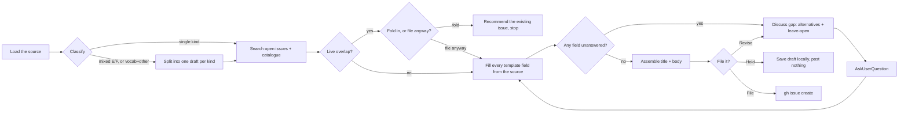

You are running the **prepare** stage — it comes *before* `/issue-review`, for
material that has no issue yet: a WIP document, a design sketch, or an idea
worked out in this session. It exists because a thin or misfiled issue costs
a round trip through `/issue-review` (§2X); this stage front-loads that cost
onto the one person who can actually close the gaps at the source.

Read first, every run:
- `docs/issue-runbook.md` — **Six kinds, three tracks**, the E/F line, and what "thin" and "front-loading" mean here
- `docs/vocabulary-catalogue.md` — every existing row, so overlap is checked against what was already decided, not just what is open
- `.github/ISSUE_TEMPLATE/` — the six forms; the fields below come from these files, not from memory
- `.agents/rules/ai-attribution.md` — this session's identity, for the one line noted in step 6

Arguments: `$ARGUMENTS` — a path to a document, e.g. `docs/WIP/SIMULATIONS.md`.
If empty, the source is the conversation preceding this command in the
session; say so before drafting anything, so the maintainer can correct the
source if that reading is wrong.

## 1. Load the source

Read the file at `$ARGUMENTS` in full, or, if empty, the conversation
preceding this command. State which one you used in one line before
proceeding — a wrong guess here invalidates everything after it.

A source rarely maps onto one template field at a time; it is prose that
answers several fields at once, in no particular order, and sometimes
answers a field the chosen template does not even ask. Read it whole before
touching step 2, not field-by-field against the template.

## 2. Classify the kind

Use the same order `/issue-review` §1 uses for a blank issue, since there is
no form here to read labels from:

1. **Is this one mapper, operator, reducer, or sorting rule?** → Vocabulary
   request. One primitive per issue — if the source proposes several, each
   gets its own draft and its own pass through steps 3–7.
2. **Does it change what a document means** — syntax, evaluation, the
   finding set, write-back? → Language feature.
3. **Does it change what a machine sees** — CLI options, exit codes, CI,
   releasing, the extension? → Tooling, CLI, or process change.
4. **Does it name behaviour that contradicts something already specified?**
   → Bug report — reproduce it before drafting (§3T below); most bugs stay
   a bug and never reach a catalogue row.
5. **Is it about the landing page, playground, tutorial, or reference
   docs?** → Site, playground, or docs change.
6. **Is it a positioning, prioritisation, or outreach argument with no
   single concrete change?** → Project direction or outreach. State the
   claim as one falsifiable sentence before drafting anything else.

**The E/F line applies here exactly as it does at review time**: what a
*document* means is language; what a *machine* invoking `visimark` sees is
tooling. A source that proposes both — a new statement in the language
*and* a new CLI verb to run it, say — is two drafts, not one with two
sections. Say so, name the two halves, and run steps 3–7 once per half,
independently. Do not let one half's gaps block the other's.

If the source does not settle its own kind — it reads as a topic, not a
proposal — say what you'd classify it as and why, then confirm with
**AskUserQuestion** before drafting: guessing the kind wrong wastes every
step that follows it.

## 3. Search for overlap before drafting

Do this before filling a single field — a live duplicate changes whether
drafting is worth doing at all.

- `gh issue list --state open --search "<2-4 keywords from the proposal>"` —
  and again with `--state closed` to catch a `DEFERRED`/`REJECTED` issue
  whose row says "reopen only with new information".
- Grep `docs/vocabulary-catalogue.md` for the same keywords across every
  section, A–F — a decided row is the more authoritative hit, since an open
  issue can still be thin or misfiled.

**A live open issue on the same proposal** → present it, then
**AskUserQuestion**: "Fold into #<n>, or draft a new issue anyway?"
- **Fold in** — stop here. Recommend commenting on #<n> or running
  `/issue-discuss <n>` instead; draft nothing new.
- **File anyway** — the maintainer judges it's a distinct proposal; continue
  to step 4, and note the related issue in the drafted body so the reviewer
  sees it too.

**A `DEFERRED`/`REJECTED` catalogue row on the same ground** → surface the
row and its deciding comment, and ask whether the source has new
information the decision didn't have. No → recommend not filing. Yes →
continue, and carry the new information into the field it changes.

## 3T. If the kind is Bug report

Before drafting the form, reproduce it: run the document or session against
the current build the way `/issue-review` §2B does, quote the real output,
and name the design-doc section, `function-reference.md` row, or
`cli-reference.md` line it contradicts. If it does not reproduce, say so and
recommend against filing rather than drafting a bug nobody can act on.

## 4. Fill every field from the source

For the chosen template, take its field list straight from the `.yml` file
(not from memory — a field description often states the exact bar an answer
must clear, e.g. "a request with no motivating document is deferred by
default"). For each field:

- **Answer it from the source**, in the field's own words where the source
  already used them, and mark it **filled**.
- **Verify, don't just transcribe**, anywhere the source makes a checkable
  claim — a `vmark` block that should pass `check`, a CLI session that
  should reproduce, a design-doc citation that should exist. Run it (`bun
  run packages/visimark/src/cli/main.ts <cmd>` against a temp copy, never
  `bunx`) and correct the field if the source and the tool disagree.
- **Mark it a gap** where the source is silent, ambiguous, or contradicts
  itself, and move it to step 5. Do not paper over a gap with a plausible-
  sounding guess — that is exactly the contradiction `/issue-review` exists
  to catch, just moved one stage earlier.

A field the template marks optional (`required: false`) is not exempt from
this pass — an unanswered optional field is still worth one line saying why
it's empty, which is faster to write now than to reconstruct later.

**Never cite a place a reader can't follow.** Before a field names a file
path or a branch as where something lives, check it is actually there for a
reader to find: `git ls-files --error-unmatch <path>` (fails on an untracked
or gitignored file) and, for a branch, `git ls-remote --heads origin
<branch>` (empty output means it never left this machine). A source document
under `docs/WIP/` is gitignored by convention and a branch used only to
verify a claim is routinely local-only — neither is citable evidence once
the issue is filed. Where the check fails, paste the material the field
needs directly into the body instead of pointing at it: the `vmark` block,
the exact prose, the CLI session run against a temp copy. The templates
already ask for this ("paste the table and its vmark block") rather than a
link, so inlining is the form's own default, not a workaround. Only a file
or branch that both checks pass may be named as a reference.

## 5. Discuss each gap

Work gaps in template order, not the order they were found — a gap in an
early field sometimes closes a later one. For each:

1. **State the gap plainly**: which field, and what happens if it stays
   blank (an INCOMPLETE vocab request, a thin language/tooling issue bounced
   back at `/issue-review` §2X, or an open fork carried unresolved into
   `/issue-decide`).
2. **Propose one to three concrete answers**, drawn from the source
   material and, where the field asks for it, checked against the design
   doc's constraints ([§2](../../docs/visimark-design.md#2-constraints-that-shaped-the-design))
   or the vocabulary criteria — not generic options, the actual candidate
   wording for this field. Say the trade-off of each in one clause.
3. **Always offer "Leave open"** — file the field with the gap named as an
   explicit open question, in whatever field the template gives that a
   home (`The forks left open`, `Anything else`, or a plain sentence
   where the template has no such field). This is a legitimate, complete
   answer — an empty forks list is fine, an *unnamed* gap is not.
4. Ask via **AskUserQuestion** — batch related gaps into one call (up to
   four questions) rather than one call per field. Options are the
   candidates from (2) plus **Leave open**; never restate the whole drafted
   field in the question, just what's undecided.
5. Write the resolution into the field. "Leave open" writes the gap itself,
   as a real sentence a reviewer could act on, not a placeholder.

Loop until no field is an unresolved gap. A field can legitimately end in
"left open: <question>" — that is not the same as unresolved.

## 6. Assemble the draft

- **Title**: the template's own prefix (`vocabulary:`, `feature:`, `chore:`,
  `bug:`, `docs:`, `direction:`) plus one line.
- **Voice**: an issue is read by whoever finds it, not addressed to one
  person — write every field's content in third person, never "you" or
  "your". Where a template's own rendered label is second person (`The
  forks you left open`, `What you considered and rejected`, `What you want
  decided`), drop the pronoun in the drafted header (`The forks left open`,
  `What was considered and rejected`, `What should be decided`) rather than
  reproduce it. This is a deliberate wording change from the six `.yml`
  files, not an oversight, and it is a known, accepted mismatch:
  `/issue-review` reads a language- or tooling-track issue by matching its
  own listed field names against the issue's bold headers verbatim, so a
  reworded header will not match until that list is updated the same way.
  Say so plainly in the draft's own preface line so nobody mistakes it for
  an accident. An issue filed straight through the GitHub form still shows
  the original wording; making the forms and `/issue-review` consistent
  with this is a separate tooling change, not something this command does
  unasked.
- **Body**: one paragraph per field, each opening with the field's bold
  label (reworded per **Voice** above where the template's own label needs
  it). Field order matches the template.
- **Labels**: the template's own `labels:` list.
- Lead the body with one italic line: `_Prepared with an agent from
  <source>, gaps resolved with the maintainer below; the fields are the
  maintainer's answers, not a substitute for review._` — the same spirit as
  `/issue-review`'s `**Automated pre-review**` marker, so a reader knows how
  this text came to exist without it reading as the maintainer's own prose.
  If any header was reworded per **Voice**, add a second sentence naming
  which ones, so `/issue-review`'s literal field-name lookup is not left to
  discover the mismatch on its own.
- If step 3 found a related (but not duplicate) issue, add one line naming
  it before the fields.

## 7. Confirm, then post — or don't

Print the full draft (title, labels, body) as an ordinary chat message —
never only inside a tool call or an approval-prompt body.

**AskUserQuestion**: "File this issue?" —
- **File** — publish it now.
- **Hold** — write the draft to `docs/WIP/<slug>-issue-draft.md` (front
  matter: `<!-- kind: <kind>; template: <file>.yml -->`), post nothing, and
  say where it landed and that `/issue-prepare docs/WIP/<slug>-issue-draft.md`
  picks it back up later.
- **Revise** — say what to change; redraft from step 5 or 6 as the change
  requires, print the new draft, and ask again.

On **File**: write the body to a temp file, run
`gh issue create --title "<title>" --body-file <file> --label <label> [--label <label> ...]`,
capture the number and URL from the command's output, and print them. Then:
"Filed as #<n>. Run `/issue-review <n> --draft` to see it pre-reviewed
before anything else posts, or `/issue-review <n>` to post the pre-review
directly."

On **Hold**: print the saved path and stop. Nothing reaches GitHub.

On **Revise**: loop back into step 5/6; do not re-run step 3's overlap
search unless the revision changed the kind or the core proposal.
