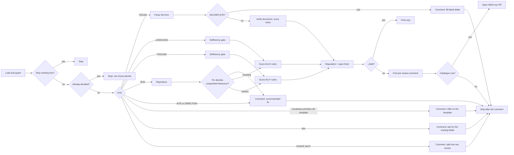

You are running the **pre-review** stage of the issue-review workflow.

Read first, every run:
- `.agents/rules/ai-attribution.md` — commit / PR trailer for **this** session (never copy a hardcoded Claude line)
- `docs/superpowers/specs/2026-09-06-vocabulary-review-workflow-design.md` — the design
- `docs/vocabulary-catalogue.md` — the register you will add a row to, its four vocabulary criteria, the six-template table in its preface, and sections E–F
- `docs/issue-runbook.md` — **Six kinds, three tracks**, and **Front-loading**: what this stage must leave settled for `/issue-decide`
- `.github/ISSUE_TEMPLATE/` — the forms. A rendered issue's field labels are these files' `label:` values, so the form tells you the kind and hands you the answers
- `docs/visimark-design.md` — [§1](../../docs/visimark-design.md#1-purpose) (purpose, non-goals), [§2](../../docs/visimark-design.md#2-constraints-that-shaped-the-design) (constraints), [§4](../../docs/visimark-design.md#4-syntax) (shape system), [§7](../../docs/visimark-design.md#7-numeric-semantics) (numeric semantics), [§9](../../docs/visimark-design.md#9-write-back) (write-back), [§14](../../docs/visimark-design.md#14-deferred) (deferred)

Arguments: `$ARGUMENTS`
- First token: the issue number `<n>`.
- `--draft` present anywhere: do the analysis, print it, post and branch nothing.




## 1. Load and guard

Run `git status --porcelain`. If it is non-empty, stop: "Working tree is dirty — commit or stash first." Do nothing else.

Run `gh issue view <n> --json number,title,body,labels,author,url,state,comments`.

**Already decided** — refuse and say "Already decided — use /issue-decide or the reopen path" if:
- any comment body starts with `Decision: ` and its author is the repository owner, or
- `docs/vocabulary-catalogue.md` already has a row linking `#<n>` whose Status cell is not empty and not `NEW`.

**Pick the kind.** This routes everything below. Determine it in this order —
stop at the first that answers:

1. **The form's field labels.** A rendered template carries its fields as bold
   labels. Match them against `.github/ISSUE_TEMPLATE/`:
   `Precision behaviour` → vocabulary; `What it touches` → language feature;
   `The machine contract` / `Area` → tooling; `Does a wrong number survive it?`
   → bug; `Which surface` → site/docs; `The claim` → direction.
2. **Labels.** `vocabulary` → VOCAB. `language` → LANGUAGE. `tooling` →
   TOOLING. `bug` → BUG. `documentation` → SITE. `question` → DIRECTION.
3. **The prose**, for a blank issue. Classify it into one of the six kinds
   yourself, using the table in `docs/issue-runbook.md`, and **say in the
   pre-review which kind you assigned and on what evidence** — the maintainer
   may move it.

| Kind | Track | Section | Go to |
|---|---|---|---|
| Vocabulary request | VOCAB | A–D | §2V |
| Language feature | LANGUAGE | E | §2L |
| Tooling, CLI, or process | TOOLING | F | §2T |
| Bug report | — (may promote) | none / E / F | §2B |
| Site, playground, or docs | — | none | §2N |
| Project direction or outreach | — | none | §2N |

**The E/F line, applied mechanically.** What a *document* means is E. What a
*machine* invoking `visimark` sees — options, exit codes, the stdout/stderr
split, the `--json` shape, the composite Action — is F. `--json` (#60) is F.
Refusing an unrecognised option (#121) is F. A new finding is E; how that
finding is *printed* is F.

**A mixed proposal is split, not decided.** If the issue changes both a
document's meaning and the command's surface in ways that could be decided
separately, post a comment naming the two halves, recommend filing the surface
half on the [tooling form](../../.github/ISSUE_TEMPLATE/tooling-change.yml),
and stop — no rubric, no row, no PR. One row, one reason; a row that covers two
decisions cannot be cited for either.

A title starting `vocabulary: ` with no `vocabulary` label (or vice versa), or
any off-template issue proposing a single primitive, is a malformed vocabulary
request: comment asking the author to refile on the template, then stop.

---

## 2V. Vocab track

### 2V.1 Parse the request

The body is the rendered issue form. Extract each field by its bold label:
`Name`, `Kind`, `Signature and shape`, `Precision behaviour`, `What it does`,
`Worked values`, `What it refuses`, `Rounding rule, if it has one`,
`The real document that needs it`, `Why not existing vocabulary or an input column`,
`Constraint check`, `Anything else`.

If any field except `Rounding rule, if it has one` and `Anything else` is blank
or missing, set **INCOMPLETE**. An older issue filed before `Worked values` and
`What it refuses` existed is not INCOMPLETE for missing them — derive them from
`What it does` and flag both as open forks instead.

These fields are the `FnDoc` in `packages/visimark/src/lang/reference.ts`. Map
them as you parse, so the pre-review hands `/issue-decide` a near-complete
entry rather than prose to re-read:

| Field | `FnDoc` member | Check |
|---|---|---|
| `Signature and shape` | `params`, `returns` | Arity matches the parameter count |
| `Precision behaviour` | `precision` | The answer is one of the six `FnPrecision` variants; `Not sure` is an open fork, not a rejection |
| `Worked values` | `examples` | Each output's decimal width is what the stated precision rule produces — a mismatch here is the single most common latent contradiction |
| `What it refuses` | `errors` | Every case names a [§10](../../docs/visimark-design.md#10-error-taxonomy) code; no sentinel value, no `NaN`, no empty result (constraint 3, and the reason #122 was a bug) |
| `Rounding rule…` | `rounding` | Present only where ties are possible |

Compute `<slug>` from `Name`: lowercase, every run of non-`[a-z0-9]` → single `-`, trim `-`. If empty, slugify the `Kind` word instead (`operator`, `sorting-rule`). The branch is `vocab/issue-<n>-<slug>`.

### 2V.2 Verify the motivating document

Skip if INCOMPLETE. Run the shared procedure in §3 against the `The real document that needs it` field.

### 2V.3 Rubric

Score each pass / fail / unclear, and cite the design-doc section:
1. **In scope** — one primitive; vocabulary, not syntax. A sorting-rule request *is* in scope and targets catalogue section D ([§D](../../docs/vocabulary-catalogue.md#d-sorting-rules) says an open issue is what makes it a proposal).
2. **Criterion 1 — shape** ([§4](../../docs/visimark-design.md#4-syntax) "Shape: map and reduce") — mapper scalar→scalar; reducer vector→scalar over a **bare column reference**; no vector→vector; a mapper result is number/date/string, never boolean.
3. **Criterion 2 — document-local** ([§2](../../docs/visimark-design.md#2-constraints-that-shaped-the-design) constraint 4) — no locale, clock, network, ambient data, config. This rejected `TODAY()`, `WORKDAY()`.
4. **Criterion 3 — no ambiguity** ([§2](../../docs/visimark-design.md#2-constraints-that-shaped-the-design) constraint 3) — no context-dependent coercion; watch radians vs degrees, string index base, `blank` handling, precision with no binding to infer from.
5. **Criterion 4 — a real document needs it** ([§14](../../docs/visimark-design.md#14-deferred)) — the motivating document exercises the primitive **and** existing vocabulary or a human-written input column does not already cover it. Fails outright if DOC_UNVERIFIED.
6. **Overlap** — against the nine builtins, the operator set, and **every existing catalogue row**. If a `DEFERRED`/`REJECTED` row already covers it, link that row's deciding comment and note "reopen only with new information".
7. **Precision cost** ([§7](../../docs/visimark-design.md#7-numeric-semantics)) — irrational or binary-float results that dent "re-add it on a calculator".
8. **Precision is consistent with the worked values** — the declared `FnPrecision` variant actually yields the decimal width of every example given. If it does not, one of the two is wrong; say which and why.
9. **Refusals are complete** — walk zero, negative, empty, non-numeric, wrong arity, and any domain boundary the signature implies. Each one either has a worked value or a named [§10](../../docs/visimark-design.md#10-error-taxonomy) code. Anything with neither is an open fork.

Then decide **table placement** — A mappers / B operators / C reducers / D sorting — and draft the **row cells**: Name, What it does, Pros, Cons, Request (`[#<n>](<url>)`), Status (blank).

### 2V.4 Disposition

One of `APPROVED` / `DEFERRED` / `REJECTED` with a one-paragraph reason in the catalogue's idiom. If INCOMPLETE, the disposition is "ask the author to fill in: <the blank fields>".

Then list **Open forks** — every question a spec would have to close that the
form did not: an unstated boundary, an ambiguous precision answer, a refusal
with no code, an interaction with `param`, imports, `assert` or charts. Empty is
a valid and good answer; an omitted list is not. `/issue-decide` resolves these
with the maintainer before an `APPROVED` lands, so anything found here is a
question asked one stage earlier than it would otherwise be.

Go to §4.

---

## 2L. Language track — catalogue section E

The issue changes what a **document means**. Filed on the
[Language feature](../../.github/ISSUE_TEMPLATE/language-feature.yml) form, or
classified there.

### 2L.1 Read what the form already answered

Fields: `Summary`, `The real document that needs it`, `What it touches`,
`Findings and exit codes`, `What fmt writes`,
`How the existing commands report it`, `Constraint check`,
`The forks you left open`, `Why not existing vocabulary, an input column, or a convention`.

Do **not** re-derive an answer the form gives. Verify it, and say so — "the
form says `fmt` is unaffected; that holds, because the value is never written
back". The review's value is in what the form got wrong or left out.

`What it touches` is the amendment list: each option is a design-doc section
that must change. Carry it through to the row, because it is what the plan's
documentation task will be built from.

### 2L.2 Sufficiency gate

Require **all** of:

- **What** — a concrete proposal, not a topic.
- **A motivating document** — [§14](../../docs/visimark-design.md#14-deferred)'s bar applies to every track.
- **Syntax or semantics**, at least in sketch, and what a document cannot express or verify without it.
- **The verdict question answered** — does a document that passes `check` today still pass? An issue that changes the finding set without saying is not assessable.

Missing any → **thin**. Comment back (see §2X), stop.

### 2L.3 Slug and document verification

`<slug>` from the title (strip a leading `feature:`; lowercase; non-`[a-z0-9]`
runs → `-`; trim; cap ~40 chars). Branch `issue/<n>-<slug>`.

If the body holds a ```vmark block, run §3 against it. A `check` failure
*because the proposed syntax does not exist yet* supports "a real document
needs it" — note the distinction rather than scoring it as a failure. Where the
form gives a before **and** after document, run `check` on the before: it should
demonstrate the gap the feature closes.

### 2L.4 Rubric

Score each pass / fail / unclear / n-a, citing the design-doc section. Skip an item only with a one-line reason.

1. **In scope** — serves [§1](../../docs/visimark-design.md#1-purpose)'s purpose (calculation auditable in review, enforceable in CI) and crosses no stated non-goal (a grid, a presentation layer, cell styling, locale, Excel compatibility, Excel's function library).
2. **Constraint 1 — renders unmodified** ([§2](../../docs/visimark-design.md#2-constraints-that-shaped-the-design)) — the document still renders on GitHub, VS Code preview, Obsidian, pandoc, with no plugin.
3. **Constraint 2 — the tool writes only what it owns** ([§2](../../docs/visimark-design.md#2-constraints-that-shaped-the-design), [§9](../../docs/visimark-design.md#9-write-back)) — computed cells and anchored values only; `fmt --fix-dates` is the shape any exception must take.
4. **Constraint 3 — ambiguity is an error, never a guess** — nothing readable two ways; no context-dependent coercion; no sentinel value standing in for a failure.
5. **Constraint 4 — meaning depends only on the document text and the `visimark` version** — no config, environment, network or clock, and **no plugin architecture**.
6. **Shape system** ([§4](../../docs/visimark-design.md#4-syntax)) — scalar/vector shapes, the map/reduce split, no boolean in a cell.
7. **Findings and the taxonomy** ([§10](../../docs/visimark-design.md#10-error-taxonomy)) — every new or widened finding has a code, or the proposal says a code must be added. State the exit code `check` produces.
8. **Backward compatibility** — name a document in `docs/` that passes today and would stop passing. If one exists, that is not automatically a rejection (#122 was approved on exactly this), but it must be stated in the row's Cons and carried into the spec.
9. **Diffability** ([§9](../../docs/visimark-design.md#9-write-back), [§13](../../docs/visimark-design.md#13-testing)) — a one-input change still produces a small, readable diff; the offset splicer still applies.
10. **Command reporting** — `infer`, `explain`, `eval`, `--json`, the did-you-mean list. The surface itself is section F; how this feature *appears* in the existing surface is part of this row.
11. **Overlap** — the builtins, the operator set, existing findings, and **every catalogue row including E–F**. A `DEFERRED`/`REJECTED` row that covers it → link its deciding comment and note "reopen only with new information".
12. **Cost / precision** ([§7](../../docs/visimark-design.md#7-numeric-semantics)) — implementation size, and any dent in "re-add it on a calculator".

Draft the **section E row**: `Feature`, `What it changes`, `Pros`, `Cons`, `Request` (`[#<n>](<url>)`), `Status` (blank).

### 2L.5 Disposition and open forks

One of `APPROVED` / `DEFERRED` / `REJECTED`, one paragraph, in the catalogue's
idiom, citing the section that governs.

Then **Open design questions** — every fork a spec would have to close. Start
from the form's `The forks you left open`, then add what it missed. Work the
list systematically rather than by inspiration:

- every boundary the semantics imply — zero, negative, empty, absent, duplicate, out-of-range;
- behaviour under an upstream error ([§8](../../docs/visimark-design.md#8-evaluation) suppression);
- interaction with each feature already shipped: anchors, imports, `param`, `assert`, `chart`, column aliases, declared precision;
- what `fmt` writes and what a diff looks like;
- the exact [§10](../../docs/visimark-design.md#10-error-taxonomy) code and message wording;
- what acceptance would literally be — the fixture and the exact tool output.

This list is the deliverable that makes `/issue-decide` cheap. Being wrong on a
fork costs a sentence; missing one costs a release.

Go to §4.

---

## 2T. Tooling track — catalogue section F

The issue changes what a **machine** sees: the CLI surface, CI, releasing, the
workflow, the extension, repo layout. Filed on the
[Tooling, CLI, or process](../../.github/ISSUE_TEMPLATE/tooling-change.yml)
form, or classified there.

### 2T.1 Read what the form already answered

Fields: `Area`, `What changes`, `What happens today`, `What happens after`,
`The machine contract`, `Cost and blast radius`,
`What documentation it invalidates`, `What you considered and rejected`.

`What documentation it invalidates` is carried verbatim into the row and then
into the plan's final documentation task. This is the field that stops
`cli-reference.md`, `ci.md` and the tutorial drifting out of sync with the
tool — the most common source of debt on this track.

### 2T.2 Sufficiency gate

Require **all** of:

- **Current behaviour**, with the file, workflow or command that produces it.
- **Wanted behaviour**, and why the gap matters.
- **For a CLI change** — the before and after sessions, with exit codes. A CLI proposal without them is not assessable: the exit code *is* the contract.
- **Blast radius** — what breaks while it changes hands.

Missing any → **thin**. Comment back (see §2X), stop.

### 2T.3 Verify the current behaviour

Do not take `What happens today` on trust — the CLI is cheap to run and stale
premises are the recurring failure on this track (half of #45's had lapsed by
review time).

- **CLI change** → run the before invocation against the working tree:
  `bun run packages/visimark/src/cli/main.ts <args>` on a fixture from `docs/`,
  and capture stdout, stderr and `$?` separately. `bunx visimark` runs the
  *published* build, not the branch — never use it to establish current
  behaviour. Quote the real session in the pre-review; where it contradicts the
  issue, say so plainly.
- **CI / release / workflow change** → read the actual file in
  `.github/workflows/` or `.claude/` and quote the lines that produce today's
  behaviour.
- **Extension change** → check `editors/vscode/` and its `engines.vscode`.

### 2T.4 Rubric

Score each pass / fail / unclear / n-a.

1. **In scope** — serves [§1](../../docs/visimark-design.md#1-purpose) and crosses no non-goal.
2. **Constraint 4 still holds** — the result must not begin depending on the environment, the clock, the network or ambient config. A CLI option that changes what a document *means* is a language change wearing a flag: refuse it here and send the meaning half to section E.
3. **The machine contract is stated** — exit codes (`0` clean, `1` findings, `2` usage), the stdout/stderr split, and the `--json` shape, which is consumed and therefore versioned by convention.
4. **Backward compatibility** — would an existing CI job, script, or the composite Action behave differently? Check `docs/ci.md`, `.github/workflows/dogfood.yml` and the Action's own definition, and name what would change. This is section F's breaking-change test.
5. **Blast radius and reversibility** — what must be re-released, re-pinned, re-installed, or invalidated; can it be undone without another release.
6. **Documentation debt** — every file stating the current behaviour is named. An unnamed one is an open fork.
7. **Overlap** — every catalogue row including E–F, and any prior decision in `docs/releasing.md` or the runbook. A `DEFERRED`/`REJECTED` row that covers it → link its deciding comment.
8. **Cost** — implementation size, and whether the smallest useful version is smaller than what was proposed. Say what that smaller version is.

Draft the **section F row**: `Change`, `What it changes`, `Pros`, `Cons`, `Request` (`[#<n>](<url>)`), `Status` (blank).

### 2T.5 Disposition and open forks

Verdict as above, then **Open design questions**, worked from:

- the exact spelling of any new option, and its short form if any;
- the exit code for every new outcome;
- what each stream carries, and what `--json` emits for it;
- interaction with the options that already exist, and with `--json` in particular;
- whether the change is a breaking change for a pinned Action version, and what the migration note says;
- what acceptance is — the exact session, or the CI check that would have caught the old behaviour.

Go to §4.

---

## 2B. Bug track — a row only if the fix decides something

Filed on the [Bug report](../../.github/ISSUE_TEMPLATE/bug-report.yml) form, or
classified there.

1. **Reproduce it.** Run §3 against `The document that reproduces it`, using
   `bun run packages/visimark/src/cli/main.ts` — the branch, not the published
   build. Quote the real output. If it does not reproduce, say so with the
   session and recommend `works as specified` or ask for the missing detail.
2. **Name the clause it violates** — the design-doc section, the
   `function-reference.md` row (generated from
   `packages/visimark/src/lang/reference.ts` — a wrong entry there is a bug in
   that file), or the `cli-reference.md` line.
3. **Decide whether it promotes.** Read the form's
   `Is the correct behaviour already specified?` and check it yourself:
   - **Specified, and the tool disagrees with it** → no catalogue row. The
     pre-review carries the reproduction, the violated clause and a recommended
     fix. Stop after the comment.
   - **Unspecified — fixing it means choosing what should happen** → it
     promotes. If what gets decided is **what a document means**, run §2L's
     rubric and draft a section E row. If it is **the command's surface or the
     repo's machinery**, run §2T's rubric and draft a section F row. Say in the
     comment that the issue was promoted and why; a fix that quietly decides
     unspecified behaviour is exactly the debt this workflow exists to stop.
4. **Severity.** If the form's severity is "a wrong number survives it", lead
   the comment with that — it is the project's one unacceptable outcome and it
   outranks the disposition of everything else in flight.

Go to §4.

---

## 2N. No-row kinds — site/docs and direction

**Site, playground, or docs.** The pre-review confirms or corrects the claim,
checks that every example document in the proposal passes `check` (§3), checks
that it promises no behaviour the tool lacks, and recommends an action. No
catalogue row, no PR — stop after the comment. If the change is only possible
because of a language or tooling gap, say so and recommend filing that half on
its own form.

**Project direction or outreach.** No row, ever — the register records
decisions judged against the design constraints, and a positioning argument has
none, which is what deferred #45 whole. The pre-review does three things:
restates the claim in one falsifiable sentence; **checks every premise against
the repo as it stands today** and names the lapsed ones; and lists the concrete
changes the argument implies, each with the form it should be filed on. Stop
after the comment.

---

## 2X. Thin issues — any track

If a sufficiency gate fails, **comment back** rather than pre-reviewing:

- Write the body to a temp file and `gh issue comment <n> --body-file <file>`.
- **Do not** use the `**Automated pre-review**` first line. Open plainly —
  `Thanks for the issue. Before this can be reviewed against the design doc, it
  needs:` — then a short bullet list naming exactly the missing pieces, by the
  field name on the template the issue should have used, with a link to that
  template.
- Then **stop**. No rubric, no branch, no PR. Print the comment URL and:
  "Thin issue — asked the author for specifics. Re-run /issue-review <n> once
  they reply."

---

## 3. Verify a motivating document (shared)

Given a field or block that should contain a VisiMark document:

- **Contains a ```vmark fenced block** → `d="$(mktemp -d)"`, write it to `"$d/<slug>.md"`, then run `bun run packages/visimark/src/cli/main.ts check "$d/<slug>.md"` and the same with `infer`. Keep the exact stdout/stderr and the exit code. **Never `bunx visimark`** — that silently runs the *published* build, so it would report on a release rather than on `master`.
- **Only a link** → fetch it: `gh api "repos/{owner}/{repo}/contents/{path}" -q .content | base64 -d` for a github.com repo file, else WebFetch. On success run the same two commands. On any failure set **DOC_UNVERIFIED**.
- **Neither** → set DOC_UNVERIFIED.

Interpret:
- `check` failing *because a binding calls a proposed unknown function or uses syntax that does not exist yet* → the document is genuinely written to the proposal (supports "a real document needs it").
- `infer` reproducing every number using only existing vocabulary → the addition is not needed.

## 4. Output

### With --draft

Print: the kind, the track, and how the kind was determined (form fields, labels, or your own classification); the parsed request or the analysed proposal; every rubric item with its verdict and citation; the `check` / `infer` output or the before/after CLI session if run; the disposition; the proposed catalogue row; and the Open design questions. End with: "Re-run without --draft to publish the pre-review, or run /issue-decide <n>." Post and branch nothing.

### Without --draft

**Post the pre-review comment.** Write the body to a temp file and run `gh issue comment <n> --body-file <file>`. First line verbatim:
`**Automated pre-review** — analysis for the maintainer's decision, not a decision itself.`
Then, in order: the kind and the catalogue section it targets (and, if you
classified an off-template issue yourself, that you did and on what evidence);
the parsed request or analysed proposal; each rubric item (verdict + cited §);
the `check` / `infer` output or the before/after CLI session in a fenced block
if run; overlap findings; the **Open design questions**; the recommended
disposition; and the proposed catalogue row rendered as a Markdown table row.

The Open design questions are not optional decoration on any row-producing
track. They are what `/issue-decide` works through with the maintainer before
an `APPROVED` lands, and every one raised here is a contradiction not
discovered during implementation.

**Special stops — comment only, no branch, no PR:**
- VOCAB **INCOMPLETE** → the comment names the blank fields and asks the author to complete them.
- **A single vocabulary primitive off-template** → the comment asks the author to refile on the Vocabulary request template.
- **Thin issue** → handled in §2X (a plain comment, not a pre-review), already stopped.
- **Mixed E and F** → the comment names the two halves and asks for the surface half to be filed separately (§1), already stopped.
- **BUG that does not promote** → the comment carries the reproduction, the violated clause and the recommended action.
- **SITE / DIRECTION** → the comment carries the analysis; no row, ever, for DIRECTION.

**Otherwise open PR #1:**
1. `git fetch origin`
2. `git switch -c <branch> origin/master` — `<branch>` is `vocab/issue-<n>-<slug>` (VOCAB) or `issue/<n>-<slug>` (LANGUAGE, TOOLING, or a promoted BUG).
3. Add the row to the correct section table in `docs/vocabulary-catalogue.md` — A–D vocabulary, E language features (what a document means), F tooling / CLI / process (what a machine sees) — Status cell empty (rendered as ` ` — the row still has the right number of `|`), Request `[#<n>](<url>)`.
4. `git add docs/vocabulary-catalogue.md`
5. `git commit -m "$(printf 'docs: catalogue #%s (%s) as NEW\n\n%s' <n> '<name>' '<attribution-trailer>')"` — `<attribution-trailer>` from `.agents/rules/ai-attribution.md` for this session.
6. `git push -u origin HEAD`
7. `gh pr create --base master --title "Catalogue #<n>: <name> (NEW)" --body "$(printf '<one-paragraph summary of the request>\n\nDecision to follow on #%s.' <n>)"` — no `Generated with Claude Code` footer unless this session is Claude Code (same rule).
8. `git switch -`

Print the comment URL, the PR URL, and: "Discuss on the issue or here, then run /issue-decide <n> when ready."
