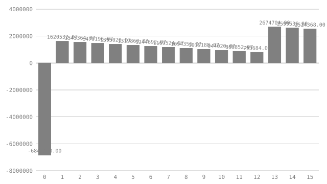

# Battery storage: a project a lender can sweep

Halden Flats is a planned grid-scale battery on the site of a retired
substation. It charges when power is cheap, discharges when it is dear, and is
paid for standing ready under the capacity market. Before a bank lends against
it, the credit committee wants answers to more than one question. How big
should the battery be? How many hours of storage? How bad can the trading
spread get? How fast can the cells fade? How much debt can it carry?

A spreadsheet answers one of those at a time, and the sensitivity tab that
answers the rest is usually a macro nobody reviews. This document holds the
model and the sweep in the same file. Its covenants are assertions, so `check`
proves the base case holds them. Its levers declare the grid a lender wants
swept, and `visimark simulate` asks every question on that grid and prints the
readings the document asks for. Every number below is derived. Change one
assumption and the next `check` says exactly what moved.

## What is invented

The site, the prices and the counterparties are made up. The orders of
magnitude are not: the capex split between power and energy, the capacity
derating for short-duration storage, the linear fade of lithium-ion capacity,
the debt terms and the covenant floors are all in the range a European battery
financing would show in 2026. The model leaves out tax, augmentation, the
construction period and reserve accounts. Each of those changes the answer, and
none of them changes how the document is put together.

## Units

Energy is power held for a time. One definition says so, and every product
of megawatts and hours in the model is then checked as megawatt-hours.

```vmark
[MWh] = [MW⋅h]
```

## The levers

Five decisions are open, and each is declared a `param`. The domain is the
range the sponsor is willing to consider. The `lattice` is the spacing at which
the lender wants that range swept. `check`, `fmt` and `eval` see only the
defaults. `simulate` sees the whole grid: 4 × 4 × 4 × 3 × 3 = 576 questions.

```vmark #levers
param power    [MW]      precision 0 integer in [40, 100] lattice 20 = default 60
param duration [h]       precision 0 integer in [1, 4] lattice 1 = default 2
param spread   [EUR/MWh] precision 0 in [60, 120] lattice 20 = default 80
param fade               precision 3 in [1.5%, 3.5%] lattice 1% = default 2.5%
param gearing            precision 2 in [60%, 80%] lattice 10% = default 70%
```

| Lever      | Meaning                                                              | Swept at        |
|------------|----------------------------------------------------------------------|-----------------|
| `power`    | Inverter rating: how fast the battery can charge or discharge        | 40, 60, 80, 100 MW |
| `duration` | Hours of storage at full power; energy capacity is power × duration  | 1, 2, 3, 4 h    |
| `spread`   | Average captured price difference between charging and discharging   | 60, 80, 100, 120 EUR/MWh |
| `fade`     | Share of the original capacity lost each year                        | 1.5%, 2.5%, 3.5% |
| `gearing`  | Debt as a share of capex                                             | 60%, 70%, 80%   |

## The fixed assumptions

These are not swept. Each is a claim the sponsor signs, and the lender reads
it once.

```vmark #market
cycles                       = 400
depth                        = 90%
efficiency                   = 87%
capacity_price [EUR/MW]      precision 2 = 45000.00
full_derating  [h]           = 4
capex_power    [EUR/MW]      precision 2 = 80000.00
capex_energy   [EUR/MWh]     precision 2 = 150000.00
opex_power     [EUR/MW]      precision 2 = 9000.00
opex_energy    [EUR/MWh]     precision 2 = 2000.00
grid_limit     [MW]          = 90
life                         = 15
wacc                         = 8%
```

`cycles` is full equivalent cycles a year, roughly one a day outside
maintenance. `depth` is the usable share of nameplate energy, and
`efficiency` is round-trip. `wacc` is the project's cost of capital. The capacity market pays a battery in proportion to
how long it can sustain its rating: a four-hour battery earns the full
`capacity_price` per MW, and a one-hour battery earns a quarter of it. The grid
connection offer is `grid_limit`. The cells are warranted for `life` years.

## The asset

```vmark #asset
energy [MWh]          = levers.power * levers.duration
throughput [MWh]      precision 2 = energy * market.depth * market.cycles
derating              precision 4 = IF(levers.duration >= market.full_derating, 1, levers.duration / market.full_derating)
arbitrage_y1 [EUR]    precision 2 = throughput * market.efficiency * levers.spread
capacity_y [EUR]      precision 2 = levers.power * market.capacity_price * derating
opex_y [EUR]          precision 2 = levers.power * market.opex_power + energy * market.opex_energy
capex [EUR]           precision 2 = levers.power * market.capex_power + energy * market.capex_energy
soh_eol               precision 4 = 1 - levers.fade * market.life
```

At the defaults the battery stores **120 MWh**<!--vmark=asset.energy|unit--> and costs
**22800000.00 EUR**<!--vmark=asset.capex|unit--> to build. In its first year it trades
**3006720.00 EUR**<!--vmark=asset.arbitrage_y1|unit--> of spread and earns
**1350000.00 EUR**<!--vmark=asset.capacity_y|unit--> from the capacity market. After
fifteen years of fade it holds **0.6250**<!--vmark=asset.soh_eol--> of its
original capacity.

## The debt

The loan is gearing × capex, repaid in equal annual instalments over the
tenor. Cash flow available for debt service (CFADS) falls every year as the
cells fade, so the tightest cover is in the last year of the loan. That is
the year the covenant is tested in.

```vmark #debt
rate      = 6.5%
tenor     = 12
dscr_floor precision 2 = 1.30
amount [EUR]  precision 2 = asset.capex * levers.gearing
service [EUR] precision 2 = PMT(rate, tenor, amount)
cfads_tenor [EUR] precision 2 = asset.arbitrage_y1 * (1 - levers.fade * (tenor - 1)) + asset.capacity_y - asset.opex_y
dscr_min precision 2 = cfads_tenor / service
```

The loan is **15960000.00 EUR**<!--vmark=debt.amount|unit-->, serviced at
**1956187.93 EUR**<!--vmark=debt.service|unit--> a year. In year twelve, CFADS covers that
**1.41**<!--vmark=debt.dscr_min-->×.

## Year by year

`Live` is 1 in an operating year and 0 in the construction year. Arbitrage
fades with the cells; the capacity payment is on the inverter rating and does
not. `Equity` is what reaches the sponsor: CFADS less debt service, with the
equity share of capex in year 0.

| Year | Live | Arbitrage [EUR] | Capacity [EUR] | Opex [EUR] | CFADS [EUR] | Service [EUR] | Flow [EUR] | Equity [EUR] |
|-----:|-----:|----------------:|---------------:|-----------:|------------:|--------------:|-----------:|-------------:|
|    0 |    0 |            0.00 |           0.00 |       0.00 |        0.00 |          0.00 |       -22800000.00 |         -6840000.00 |
|    1 |    1 |            3006720.00 |           1350000.00 |       780000.00 |        3576720.00 |          1956187.93 |       3576720.00 |         1620532.07 |
|    2 |    1 |            2931552.00 |           1350000.00 |       780000.00 |        3501552.00 |          1956187.93 |       3501552.00 |         1545364.07 |
|    3 |    1 |            2856384.00 |           1350000.00 |       780000.00 |        3426384.00 |          1956187.93 |       3426384.00 |         1470196.07 |
|    4 |    1 |            2781216.00 |           1350000.00 |       780000.00 |        3351216.00 |          1956187.93 |       3351216.00 |         1395028.07 |
|    5 |    1 |            2706048.00 |           1350000.00 |       780000.00 |        3276048.00 |          1956187.93 |       3276048.00 |         1319860.07 |
|    6 |    1 |            2630880.00 |           1350000.00 |       780000.00 |        3200880.00 |          1956187.93 |       3200880.00 |         1244692.07 |
|    7 |    1 |            2555712.00 |           1350000.00 |       780000.00 |        3125712.00 |          1956187.93 |       3125712.00 |         1169524.07 |
|    8 |    1 |            2480544.00 |           1350000.00 |       780000.00 |        3050544.00 |          1956187.93 |       3050544.00 |         1094356.07 |
|    9 |    1 |            2405376.00 |           1350000.00 |       780000.00 |        2975376.00 |          1956187.93 |       2975376.00 |         1019188.07 |
|   10 |    1 |            2330208.00 |           1350000.00 |       780000.00 |        2900208.00 |          1956187.93 |       2900208.00 |         944020.07 |
|   11 |    1 |            2255040.00 |           1350000.00 |       780000.00 |        2825040.00 |          1956187.93 |       2825040.00 |         868852.07 |
|   12 |    1 |            2179872.00 |           1350000.00 |       780000.00 |        2749872.00 |          1956187.93 |       2749872.00 |         793684.07 |
|   13 |    1 |            2104704.00 |           1350000.00 |       780000.00 |        2674704.00 |          0.00 |       2674704.00 |         2674704.00 |
|   14 |    1 |            2029536.00 |           1350000.00 |       780000.00 |        2599536.00 |          0.00 |       2599536.00 |         2599536.00 |
|   15 |    1 |            1954368.00 |           1350000.00 |       780000.00 |        2524368.00 |          0.00 |       2524368.00 |         2524368.00 |

```vmark #years
Arbitrage precision 2 = asset.arbitrage_y1 * Live * (1 - levers.fade * (Year - 1))
Capacity  precision 2 = asset.capacity_y * Live
Opex      precision 2 = asset.opex_y * Live
CFADS     precision 2 = Arbitrage + Capacity - Opex
Service   precision 2 = IF(Live == 1, IF(Year <= debt.tenor, debt.service, 0), 0)
Flow      precision 2 = CFADS - IF(Live == 1, 0, asset.capex)
Equity    precision 2 = Flow + IF(Live == 1, 0, debt.amount) - Service

chart equity as bar of Equity labelled Year aspect 16:9
```

<!--vmark=years.equity-->

## Returns

```vmark #returns
npv [EUR]      precision 2 = NPV(market.wacc, years.Flow)
equity_irr     precision 4 = IRR(years.Equity)

report best scalar returns.equity_irr direction max among feasible
report best scalar returns.npv direction max among feasible
report deltas
```

At the defaults the project is worth **4215389.03 EUR**<!--vmark=returns.npv|unit--> at an
8% cost of capital. The sponsor's equity returns
**0.1931**<!--vmark=returns.equity_irr--> a year.

## The covenants

```vmark #credit
assert debt.dscr_min >= debt.dscr_floor
assert asset.soh_eol >= 60%
assert levers.power <= market.grid_limit
assert levers.gearing <= 75%

report gates
report forbidden
report deltas on debt.dscr_min, asset.soh_eol
```

1. **Debt service cover.** CFADS in the last debt year must cover the
   instalment at least 1.30 times.
2. **End-of-life health.** The cells must hold at least 60% of their capacity
   after fifteen years. That is the warranty the lender's technical adviser
   accepted.
3. **Grid connection.** The inverter cannot exceed the connection offer.
4. **Gearing.** The bank lends at most 75% of capex.

## Sweeping it

`check` proves that the base case is sound. The committee also wants to
know how far the levers can move before it stops being sound, and which
covenant gives way first. Three sheets ask for those readings: `#returns`
above, `#credit` above, and `#ledger` below. One command asks all 576
questions on the grid, plus the base, and prints them:

```console
$ visimark simulate example-battery-storage.md
simulate: example-battery-storage.md: 577 questions (5 lattice params)
==> example-battery-storage.md <==
#returns

report best scalar returns.equity_irr direction max among feasible

  power=40 duration=4 spread=120 fade=1.5% gearing=70%
  returns.equity_irr  0.5693  (+0.3762 against base)
  chosen from 159 feasible of 576 questions
  3 questions tie; the first in grid order is shown

report best scalar returns.npv direction max among feasible

  power=80 duration=4 spread=120 fade=1.5% gearing=60%
  returns.npv [EUR]  59078328.30  (+54862939.27 against base)
  chosen from 159 feasible of 576 questions
  2 questions tie; the first in grid order is shown

report deltas

  returns.npv [EUR]  base 4215389.03
    low   -9850576.57  (-14065965.60)  power=100 duration=1 spread=60 fade=3.5% gearing=70%
    high  73847910.37  (+69632521.34)  power=100 duration=4 spread=120 fade=1.5% gearing=60%
  returns.equity_irr  base 0.1931
    low   -0.1811  (-0.3742)  power=40 duration=1 spread=60 fade=3.5% gearing=80%
    high   0.8006  (+0.6075)  power=40 duration=4 spread=120 fade=1.5% gearing=80%
#credit

report gates

  576 questions
  assert                             holds  fails  faulted  base   first failure
  debt.dscr_min >= debt.dscr_floor     392    184        0  holds  power=40 duration=1 spread=60 fade=1.5% gearing=60%
  asset.soh_eol >= 60%                 384    192        0  holds  power=40 duration=1 spread=60 fade=3.5% gearing=60%
  levers.power <= market.grid_limit    432    144        0  holds  power=100 duration=1 spread=60 fade=1.5% gearing=60%
  levers.gearing <= 75%                384    192        0  holds  power=40 duration=1 spread=60 fade=1.5% gearing=80%

report forbidden

  power = 100    every question with it breaks an assertion
  fade = 3.5%    every question with it breaks an assertion
  gearing = 80%  every question with it breaks an assertion
  365 of 576 questions are infeasible

report deltas on debt.dscr_min, asset.soh_eol

  debt.dscr_min  base 1.41
    low   0.52  (-0.89)  power=40 duration=1 spread=60 fade=3.5% gearing=80%
    high  3.07  (+1.66)  power=40 duration=4 spread=120 fade=1.5% gearing=60%
  asset.soh_eol  base 0.6250
    low   0.4750  (-0.1500)  power=40 duration=1 spread=60 fade=3.5% gearing=70%
    high  0.7750  (+0.1500)  power=40 duration=1 spread=60 fade=1.5% gearing=70%
```

Read it top to bottom, the way a credit paper is read.

- **`best … among feasible`** looks only at questions that break no covenant.
  The equity winner is a small, long battery at the widest spread. The tie
  line is a finding in its own right. Every cost and revenue in this model is
  proportional to `power`, so equity IRR does not depend on size, and three
  sizes tie. Project NPV does not depend on `gearing`, because financing
  splits the cash flow but does not change it. That is why the NPV winner has
  a tie too.
- **`deltas`** gives the range of each figure across the grid, and the
  question that sets each end of it. The low end of every range is a corner
  where all the levers are wrong at once, and most of those corners are
  infeasible. It is a measure of exposure, not a forecast.
- **`gates`** is the covenant table a lender recognises: how often each
  covenant holds, how often it fails, and the first question in grid order
  that breaks it. Debt service cover is the covenant that binds hardest across
  the grid. The gearing and grid-connection limits fail only at the grid
  points they are meant to rule out.
- **`forbidden`** names lattice points that no other choice can rescue. A
  100 MW inverter is over the connection offer whatever else is chosen. A
  3.5% fade breaks the end-of-life warranty whatever else is chosen. These
  are not trade-offs, so the committee can take them off the table before it
  discusses anything else.
- The counts do not add up to 576 on purpose. `forbidden` counts *infeasible*
  questions, the ones where a covenant is false. A question can also be
  *faulted*. When debt service cover falls below 1.0, equity cash flow turns
  negative in the loan years and changes sign more than once, so equity IRR
  has no single answer. `simulate` will not print a number the arithmetic
  does not define. It marks the question `faulted` in the ledger and leaves it
  out of every `best` and `deltas`.

Each reading is a section of plain text under the sheet that asked for it, so
it diffs like the rest of the document. When a lever's range or a covenant
changes, the review shows what the committee would now be told.

## The case ledger

The ledger is the full grid, one row per question, with every covenant each
row breaks. It is long because it is complete. This is the table a
spreadsheet sensitivity tab cannot show without a macro.

```vmark #ledger
report ledger assertions broken
```

<details>
<summary>The ledger: 577 rows</summary>

```console
#ledger

report ledger assertions broken

  question  power [MW]  duration [h]  spread [EUR/MWh]  fade  gearing  feasible  broken
  base              60             2                80  2.5%      70%  yes
  1                 40             1                60  1.5%      60%  faulted   debt.dscr_min >= debt.dscr_floor
  2                 40             1                60  1.5%      70%  no        debt.dscr_min >= debt.dscr_floor
  3                 40             1                60  1.5%      80%  no        debt.dscr_min >= debt.dscr_floor; levers.gearing <= 75%
  4                 40             1                60  2.5%      60%  faulted   debt.dscr_min >= debt.dscr_floor
  5                 40             1                60  2.5%      70%  no        debt.dscr_min >= debt.dscr_floor
  6                 40             1                60  2.5%      80%  no        debt.dscr_min >= debt.dscr_floor; levers.gearing <= 75%
  7                 40             1                60  3.5%      60%  faulted   debt.dscr_min >= debt.dscr_floor; asset.soh_eol >= 60%
  8                 40             1                60  3.5%      70%  no        debt.dscr_min >= debt.dscr_floor; asset.soh_eol >= 60%
  9                 40             1                60  3.5%      80%  no        debt.dscr_min >= debt.dscr_floor; asset.soh_eol >= 60%; levers.gearing <= 75%
  10                40             1                80  1.5%      60%  no        debt.dscr_min >= debt.dscr_floor
  11                40             1                80  1.5%      70%  no        debt.dscr_min >= debt.dscr_floor
  12                40             1                80  1.5%      80%  faulted   debt.dscr_min >= debt.dscr_floor; levers.gearing <= 75%
  13                40             1                80  2.5%      60%  no        debt.dscr_min >= debt.dscr_floor
  14                40             1                80  2.5%      70%  faulted   debt.dscr_min >= debt.dscr_floor
  15                40             1                80  2.5%      80%  faulted   debt.dscr_min >= debt.dscr_floor; levers.gearing <= 75%
  16                40             1                80  3.5%      60%  faulted   debt.dscr_min >= debt.dscr_floor; asset.soh_eol >= 60%
  17                40             1                80  3.5%      70%  faulted   debt.dscr_min >= debt.dscr_floor; asset.soh_eol >= 60%
  18                40             1                80  3.5%      80%  faulted   debt.dscr_min >= debt.dscr_floor; asset.soh_eol >= 60%; levers.gearing <= 75%
  19                40             1               100  1.5%      60%  yes
  20                40             1               100  1.5%      70%  yes
  21                40             1               100  1.5%      80%  no        debt.dscr_min >= debt.dscr_floor; levers.gearing <= 75%
  22                40             1               100  2.5%      60%  yes
  23                40             1               100  2.5%      70%  no        debt.dscr_min >= debt.dscr_floor
  24                40             1               100  2.5%      80%  no        debt.dscr_min >= debt.dscr_floor; levers.gearing <= 75%
  25                40             1               100  3.5%      60%  no        debt.dscr_min >= debt.dscr_floor; asset.soh_eol >= 60%
  26                40             1               100  3.5%      70%  faulted   debt.dscr_min >= debt.dscr_floor; asset.soh_eol >= 60%
  27                40             1               100  3.5%      80%  faulted   debt.dscr_min >= debt.dscr_floor; asset.soh_eol >= 60%; levers.gearing <= 75%
  28                40             1               120  1.5%      60%  yes
  29                40             1               120  1.5%      70%  yes
  30                40             1               120  1.5%      80%  no        levers.gearing <= 75%
  31                40             1               120  2.5%      60%  yes
  32                40             1               120  2.5%      70%  yes
  33                40             1               120  2.5%      80%  no        debt.dscr_min >= debt.dscr_floor; levers.gearing <= 75%
  34                40             1               120  3.5%      60%  no        asset.soh_eol >= 60%
  35                40             1               120  3.5%      70%  no        debt.dscr_min >= debt.dscr_floor; asset.soh_eol >= 60%
  36                40             1               120  3.5%      80%  no        debt.dscr_min >= debt.dscr_floor; asset.soh_eol >= 60%; levers.gearing <= 75%
  37                40             2                60  1.5%      60%  yes
  38                40             2                60  1.5%      70%  no        debt.dscr_min >= debt.dscr_floor
  39                40             2                60  1.5%      80%  no        debt.dscr_min >= debt.dscr_floor; levers.gearing <= 75%
  40                40             2                60  2.5%      60%  yes
  41                40             2                60  2.5%      70%  no        debt.dscr_min >= debt.dscr_floor
  42                40             2                60  2.5%      80%  faulted   debt.dscr_min >= debt.dscr_floor; levers.gearing <= 75%
  43                40             2                60  3.5%      60%  no        debt.dscr_min >= debt.dscr_floor; asset.soh_eol >= 60%
  44                40             2                60  3.5%      70%  no        debt.dscr_min >= debt.dscr_floor; asset.soh_eol >= 60%
  45                40             2                60  3.5%      80%  faulted   debt.dscr_min >= debt.dscr_floor; asset.soh_eol >= 60%; levers.gearing <= 75%
  46                40             2                80  1.5%      60%  yes
  47                40             2                80  1.5%      70%  yes
  48                40             2                80  1.5%      80%  no        levers.gearing <= 75%
  49                40             2                80  2.5%      60%  yes
  50                40             2                80  2.5%      70%  yes
  51                40             2                80  2.5%      80%  no        debt.dscr_min >= debt.dscr_floor; levers.gearing <= 75%
  52                40             2                80  3.5%      60%  no        asset.soh_eol >= 60%
  53                40             2                80  3.5%      70%  no        debt.dscr_min >= debt.dscr_floor; asset.soh_eol >= 60%
  54                40             2                80  3.5%      80%  no        debt.dscr_min >= debt.dscr_floor; asset.soh_eol >= 60%; levers.gearing <= 75%
  55                40             2               100  1.5%      60%  yes
  56                40             2               100  1.5%      70%  yes
  57                40             2               100  1.5%      80%  no        levers.gearing <= 75%
  58                40             2               100  2.5%      60%  yes
  59                40             2               100  2.5%      70%  yes
  60                40             2               100  2.5%      80%  no        levers.gearing <= 75%
  61                40             2               100  3.5%      60%  no        asset.soh_eol >= 60%
  62                40             2               100  3.5%      70%  no        asset.soh_eol >= 60%
  63                40             2               100  3.5%      80%  no        debt.dscr_min >= debt.dscr_floor; asset.soh_eol >= 60%; levers.gearing <= 75%
  64                40             2               120  1.5%      60%  yes
  65                40             2               120  1.5%      70%  yes
  66                40             2               120  1.5%      80%  no        levers.gearing <= 75%
  67                40             2               120  2.5%      60%  yes
  68                40             2               120  2.5%      70%  yes
  69                40             2               120  2.5%      80%  no        levers.gearing <= 75%
  70                40             2               120  3.5%      60%  no        asset.soh_eol >= 60%
  71                40             2               120  3.5%      70%  no        asset.soh_eol >= 60%
  72                40             2               120  3.5%      80%  no        asset.soh_eol >= 60%; levers.gearing <= 75%
  73                40             3                60  1.5%      60%  yes
  74                40             3                60  1.5%      70%  yes
  75                40             3                60  1.5%      80%  no        debt.dscr_min >= debt.dscr_floor; levers.gearing <= 75%
  76                40             3                60  2.5%      60%  yes
  77                40             3                60  2.5%      70%  yes
  78                40             3                60  2.5%      80%  no        debt.dscr_min >= debt.dscr_floor; levers.gearing <= 75%
  79                40             3                60  3.5%      60%  no        asset.soh_eol >= 60%
  80                40             3                60  3.5%      70%  no        debt.dscr_min >= debt.dscr_floor; asset.soh_eol >= 60%
  81                40             3                60  3.5%      80%  no        debt.dscr_min >= debt.dscr_floor; asset.soh_eol >= 60%; levers.gearing <= 75%
  82                40             3                80  1.5%      60%  yes
  83                40             3                80  1.5%      70%  yes
  84                40             3                80  1.5%      80%  no        levers.gearing <= 75%
  85                40             3                80  2.5%      60%  yes
  86                40             3                80  2.5%      70%  yes
  87                40             3                80  2.5%      80%  no        levers.gearing <= 75%
  88                40             3                80  3.5%      60%  no        asset.soh_eol >= 60%
  89                40             3                80  3.5%      70%  no        asset.soh_eol >= 60%
  90                40             3                80  3.5%      80%  no        debt.dscr_min >= debt.dscr_floor; asset.soh_eol >= 60%; levers.gearing <= 75%
  91                40             3               100  1.5%      60%  yes
  92                40             3               100  1.5%      70%  yes
  93                40             3               100  1.5%      80%  no        levers.gearing <= 75%
  94                40             3               100  2.5%      60%  yes
  95                40             3               100  2.5%      70%  yes
  96                40             3               100  2.5%      80%  no        levers.gearing <= 75%
  97                40             3               100  3.5%      60%  no        asset.soh_eol >= 60%
  98                40             3               100  3.5%      70%  no        asset.soh_eol >= 60%
  99                40             3               100  3.5%      80%  no        asset.soh_eol >= 60%; levers.gearing <= 75%
  100               40             3               120  1.5%      60%  yes
  101               40             3               120  1.5%      70%  yes
  102               40             3               120  1.5%      80%  no        levers.gearing <= 75%
  103               40             3               120  2.5%      60%  yes
  104               40             3               120  2.5%      70%  yes
  105               40             3               120  2.5%      80%  no        levers.gearing <= 75%
  106               40             3               120  3.5%      60%  no        asset.soh_eol >= 60%
  107               40             3               120  3.5%      70%  no        asset.soh_eol >= 60%
  108               40             3               120  3.5%      80%  no        asset.soh_eol >= 60%; levers.gearing <= 75%
  109               40             4                60  1.5%      60%  yes
  110               40             4                60  1.5%      70%  yes
  111               40             4                60  1.5%      80%  no        levers.gearing <= 75%
  112               40             4                60  2.5%      60%  yes
  113               40             4                60  2.5%      70%  yes
  114               40             4                60  2.5%      80%  no        debt.dscr_min >= debt.dscr_floor; levers.gearing <= 75%
  115               40             4                60  3.5%      60%  no        asset.soh_eol >= 60%
  116               40             4                60  3.5%      70%  no        debt.dscr_min >= debt.dscr_floor; asset.soh_eol >= 60%
  117               40             4                60  3.5%      80%  no        debt.dscr_min >= debt.dscr_floor; asset.soh_eol >= 60%; levers.gearing <= 75%
  118               40             4                80  1.5%      60%  yes
  119               40             4                80  1.5%      70%  yes
  120               40             4                80  1.5%      80%  no        levers.gearing <= 75%
  121               40             4                80  2.5%      60%  yes
  122               40             4                80  2.5%      70%  yes
  123               40             4                80  2.5%      80%  no        levers.gearing <= 75%
  124               40             4                80  3.5%      60%  no        asset.soh_eol >= 60%
  125               40             4                80  3.5%      70%  no        asset.soh_eol >= 60%
  126               40             4                80  3.5%      80%  no        asset.soh_eol >= 60%; levers.gearing <= 75%
  127               40             4               100  1.5%      60%  yes
  128               40             4               100  1.5%      70%  yes
  129               40             4               100  1.5%      80%  no        levers.gearing <= 75%
  130               40             4               100  2.5%      60%  yes
  131               40             4               100  2.5%      70%  yes
  132               40             4               100  2.5%      80%  no        levers.gearing <= 75%
  133               40             4               100  3.5%      60%  no        asset.soh_eol >= 60%
  134               40             4               100  3.5%      70%  no        asset.soh_eol >= 60%
  135               40             4               100  3.5%      80%  no        asset.soh_eol >= 60%; levers.gearing <= 75%
  136               40             4               120  1.5%      60%  yes
  137               40             4               120  1.5%      70%  yes
  138               40             4               120  1.5%      80%  no        levers.gearing <= 75%
  139               40             4               120  2.5%      60%  yes
  140               40             4               120  2.5%      70%  yes
  141               40             4               120  2.5%      80%  no        levers.gearing <= 75%
  142               40             4               120  3.5%      60%  no        asset.soh_eol >= 60%
  143               40             4               120  3.5%      70%  no        asset.soh_eol >= 60%
  144               40             4               120  3.5%      80%  no        asset.soh_eol >= 60%; levers.gearing <= 75%
  145               60             1                60  1.5%      60%  faulted   debt.dscr_min >= debt.dscr_floor
  146               60             1                60  1.5%      70%  no        debt.dscr_min >= debt.dscr_floor
  147               60             1                60  1.5%      80%  no        debt.dscr_min >= debt.dscr_floor; levers.gearing <= 75%
  148               60             1                60  2.5%      60%  faulted   debt.dscr_min >= debt.dscr_floor
  149               60             1                60  2.5%      70%  no        debt.dscr_min >= debt.dscr_floor
  150               60             1                60  2.5%      80%  no        debt.dscr_min >= debt.dscr_floor; levers.gearing <= 75%
  151               60             1                60  3.5%      60%  faulted   debt.dscr_min >= debt.dscr_floor; asset.soh_eol >= 60%
  152               60             1                60  3.5%      70%  no        debt.dscr_min >= debt.dscr_floor; asset.soh_eol >= 60%
  153               60             1                60  3.5%      80%  no        debt.dscr_min >= debt.dscr_floor; asset.soh_eol >= 60%; levers.gearing <= 75%
  154               60             1                80  1.5%      60%  no        debt.dscr_min >= debt.dscr_floor
  155               60             1                80  1.5%      70%  no        debt.dscr_min >= debt.dscr_floor
  156               60             1                80  1.5%      80%  faulted   debt.dscr_min >= debt.dscr_floor; levers.gearing <= 75%
  157               60             1                80  2.5%      60%  no        debt.dscr_min >= debt.dscr_floor
  158               60             1                80  2.5%      70%  faulted   debt.dscr_min >= debt.dscr_floor
  159               60             1                80  2.5%      80%  faulted   debt.dscr_min >= debt.dscr_floor; levers.gearing <= 75%
  160               60             1                80  3.5%      60%  faulted   debt.dscr_min >= debt.dscr_floor; asset.soh_eol >= 60%
  161               60             1                80  3.5%      70%  faulted   debt.dscr_min >= debt.dscr_floor; asset.soh_eol >= 60%
  162               60             1                80  3.5%      80%  faulted   debt.dscr_min >= debt.dscr_floor; asset.soh_eol >= 60%; levers.gearing <= 75%
  163               60             1               100  1.5%      60%  yes
  164               60             1               100  1.5%      70%  yes
  165               60             1               100  1.5%      80%  no        debt.dscr_min >= debt.dscr_floor; levers.gearing <= 75%
  166               60             1               100  2.5%      60%  yes
  167               60             1               100  2.5%      70%  no        debt.dscr_min >= debt.dscr_floor
  168               60             1               100  2.5%      80%  no        debt.dscr_min >= debt.dscr_floor; levers.gearing <= 75%
  169               60             1               100  3.5%      60%  no        debt.dscr_min >= debt.dscr_floor; asset.soh_eol >= 60%
  170               60             1               100  3.5%      70%  faulted   debt.dscr_min >= debt.dscr_floor; asset.soh_eol >= 60%
  171               60             1               100  3.5%      80%  faulted   debt.dscr_min >= debt.dscr_floor; asset.soh_eol >= 60%; levers.gearing <= 75%
  172               60             1               120  1.5%      60%  yes
  173               60             1               120  1.5%      70%  yes
  174               60             1               120  1.5%      80%  no        levers.gearing <= 75%
  175               60             1               120  2.5%      60%  yes
  176               60             1               120  2.5%      70%  yes
  177               60             1               120  2.5%      80%  no        debt.dscr_min >= debt.dscr_floor; levers.gearing <= 75%
  178               60             1               120  3.5%      60%  no        asset.soh_eol >= 60%
  179               60             1               120  3.5%      70%  no        debt.dscr_min >= debt.dscr_floor; asset.soh_eol >= 60%
  180               60             1               120  3.5%      80%  no        debt.dscr_min >= debt.dscr_floor; asset.soh_eol >= 60%; levers.gearing <= 75%
  181               60             2                60  1.5%      60%  yes
  182               60             2                60  1.5%      70%  no        debt.dscr_min >= debt.dscr_floor
  183               60             2                60  1.5%      80%  no        debt.dscr_min >= debt.dscr_floor; levers.gearing <= 75%
  184               60             2                60  2.5%      60%  yes
  185               60             2                60  2.5%      70%  no        debt.dscr_min >= debt.dscr_floor
  186               60             2                60  2.5%      80%  faulted   debt.dscr_min >= debt.dscr_floor; levers.gearing <= 75%
  187               60             2                60  3.5%      60%  no        debt.dscr_min >= debt.dscr_floor; asset.soh_eol >= 60%
  188               60             2                60  3.5%      70%  no        debt.dscr_min >= debt.dscr_floor; asset.soh_eol >= 60%
  189               60             2                60  3.5%      80%  faulted   debt.dscr_min >= debt.dscr_floor; asset.soh_eol >= 60%; levers.gearing <= 75%
  190               60             2                80  1.5%      60%  yes
  191               60             2                80  1.5%      70%  yes
  192               60             2                80  1.5%      80%  no        levers.gearing <= 75%
  193               60             2                80  2.5%      60%  yes
  194               60             2                80  2.5%      70%  yes
  195               60             2                80  2.5%      80%  no        debt.dscr_min >= debt.dscr_floor; levers.gearing <= 75%
  196               60             2                80  3.5%      60%  no        asset.soh_eol >= 60%
  197               60             2                80  3.5%      70%  no        debt.dscr_min >= debt.dscr_floor; asset.soh_eol >= 60%
  198               60             2                80  3.5%      80%  no        debt.dscr_min >= debt.dscr_floor; asset.soh_eol >= 60%; levers.gearing <= 75%
  199               60             2               100  1.5%      60%  yes
  200               60             2               100  1.5%      70%  yes
  201               60             2               100  1.5%      80%  no        levers.gearing <= 75%
  202               60             2               100  2.5%      60%  yes
  203               60             2               100  2.5%      70%  yes
  204               60             2               100  2.5%      80%  no        levers.gearing <= 75%
  205               60             2               100  3.5%      60%  no        asset.soh_eol >= 60%
  206               60             2               100  3.5%      70%  no        asset.soh_eol >= 60%
  207               60             2               100  3.5%      80%  no        debt.dscr_min >= debt.dscr_floor; asset.soh_eol >= 60%; levers.gearing <= 75%
  208               60             2               120  1.5%      60%  yes
  209               60             2               120  1.5%      70%  yes
  210               60             2               120  1.5%      80%  no        levers.gearing <= 75%
  211               60             2               120  2.5%      60%  yes
  212               60             2               120  2.5%      70%  yes
  213               60             2               120  2.5%      80%  no        levers.gearing <= 75%
  214               60             2               120  3.5%      60%  no        asset.soh_eol >= 60%
  215               60             2               120  3.5%      70%  no        asset.soh_eol >= 60%
  216               60             2               120  3.5%      80%  no        asset.soh_eol >= 60%; levers.gearing <= 75%
  217               60             3                60  1.5%      60%  yes
  218               60             3                60  1.5%      70%  yes
  219               60             3                60  1.5%      80%  no        debt.dscr_min >= debt.dscr_floor; levers.gearing <= 75%
  220               60             3                60  2.5%      60%  yes
  221               60             3                60  2.5%      70%  yes
  222               60             3                60  2.5%      80%  no        debt.dscr_min >= debt.dscr_floor; levers.gearing <= 75%
  223               60             3                60  3.5%      60%  no        asset.soh_eol >= 60%
  224               60             3                60  3.5%      70%  no        debt.dscr_min >= debt.dscr_floor; asset.soh_eol >= 60%
  225               60             3                60  3.5%      80%  no        debt.dscr_min >= debt.dscr_floor; asset.soh_eol >= 60%; levers.gearing <= 75%
  226               60             3                80  1.5%      60%  yes
  227               60             3                80  1.5%      70%  yes
  228               60             3                80  1.5%      80%  no        levers.gearing <= 75%
  229               60             3                80  2.5%      60%  yes
  230               60             3                80  2.5%      70%  yes
  231               60             3                80  2.5%      80%  no        levers.gearing <= 75%
  232               60             3                80  3.5%      60%  no        asset.soh_eol >= 60%
  233               60             3                80  3.5%      70%  no        asset.soh_eol >= 60%
  234               60             3                80  3.5%      80%  no        debt.dscr_min >= debt.dscr_floor; asset.soh_eol >= 60%; levers.gearing <= 75%
  235               60             3               100  1.5%      60%  yes
  236               60             3               100  1.5%      70%  yes
  237               60             3               100  1.5%      80%  no        levers.gearing <= 75%
  238               60             3               100  2.5%      60%  yes
  239               60             3               100  2.5%      70%  yes
  240               60             3               100  2.5%      80%  no        levers.gearing <= 75%
  241               60             3               100  3.5%      60%  no        asset.soh_eol >= 60%
  242               60             3               100  3.5%      70%  no        asset.soh_eol >= 60%
  243               60             3               100  3.5%      80%  no        asset.soh_eol >= 60%; levers.gearing <= 75%
  244               60             3               120  1.5%      60%  yes
  245               60             3               120  1.5%      70%  yes
  246               60             3               120  1.5%      80%  no        levers.gearing <= 75%
  247               60             3               120  2.5%      60%  yes
  248               60             3               120  2.5%      70%  yes
  249               60             3               120  2.5%      80%  no        levers.gearing <= 75%
  250               60             3               120  3.5%      60%  no        asset.soh_eol >= 60%
  251               60             3               120  3.5%      70%  no        asset.soh_eol >= 60%
  252               60             3               120  3.5%      80%  no        asset.soh_eol >= 60%; levers.gearing <= 75%
  253               60             4                60  1.5%      60%  yes
  254               60             4                60  1.5%      70%  yes
  255               60             4                60  1.5%      80%  no        levers.gearing <= 75%
  256               60             4                60  2.5%      60%  yes
  257               60             4                60  2.5%      70%  yes
  258               60             4                60  2.5%      80%  no        debt.dscr_min >= debt.dscr_floor; levers.gearing <= 75%
  259               60             4                60  3.5%      60%  no        asset.soh_eol >= 60%
  260               60             4                60  3.5%      70%  no        debt.dscr_min >= debt.dscr_floor; asset.soh_eol >= 60%
  261               60             4                60  3.5%      80%  no        debt.dscr_min >= debt.dscr_floor; asset.soh_eol >= 60%; levers.gearing <= 75%
  262               60             4                80  1.5%      60%  yes
  263               60             4                80  1.5%      70%  yes
  264               60             4                80  1.5%      80%  no        levers.gearing <= 75%
  265               60             4                80  2.5%      60%  yes
  266               60             4                80  2.5%      70%  yes
  267               60             4                80  2.5%      80%  no        levers.gearing <= 75%
  268               60             4                80  3.5%      60%  no        asset.soh_eol >= 60%
  269               60             4                80  3.5%      70%  no        asset.soh_eol >= 60%
  270               60             4                80  3.5%      80%  no        asset.soh_eol >= 60%; levers.gearing <= 75%
  271               60             4               100  1.5%      60%  yes
  272               60             4               100  1.5%      70%  yes
  273               60             4               100  1.5%      80%  no        levers.gearing <= 75%
  274               60             4               100  2.5%      60%  yes
  275               60             4               100  2.5%      70%  yes
  276               60             4               100  2.5%      80%  no        levers.gearing <= 75%
  277               60             4               100  3.5%      60%  no        asset.soh_eol >= 60%
  278               60             4               100  3.5%      70%  no        asset.soh_eol >= 60%
  279               60             4               100  3.5%      80%  no        asset.soh_eol >= 60%; levers.gearing <= 75%
  280               60             4               120  1.5%      60%  yes
  281               60             4               120  1.5%      70%  yes
  282               60             4               120  1.5%      80%  no        levers.gearing <= 75%
  283               60             4               120  2.5%      60%  yes
  284               60             4               120  2.5%      70%  yes
  285               60             4               120  2.5%      80%  no        levers.gearing <= 75%
  286               60             4               120  3.5%      60%  no        asset.soh_eol >= 60%
  287               60             4               120  3.5%      70%  no        asset.soh_eol >= 60%
  288               60             4               120  3.5%      80%  no        asset.soh_eol >= 60%; levers.gearing <= 75%
  289               80             1                60  1.5%      60%  faulted   debt.dscr_min >= debt.dscr_floor
  290               80             1                60  1.5%      70%  no        debt.dscr_min >= debt.dscr_floor
  291               80             1                60  1.5%      80%  no        debt.dscr_min >= debt.dscr_floor; levers.gearing <= 75%
  292               80             1                60  2.5%      60%  faulted   debt.dscr_min >= debt.dscr_floor
  293               80             1                60  2.5%      70%  no        debt.dscr_min >= debt.dscr_floor
  294               80             1                60  2.5%      80%  no        debt.dscr_min >= debt.dscr_floor; levers.gearing <= 75%
  295               80             1                60  3.5%      60%  faulted   debt.dscr_min >= debt.dscr_floor; asset.soh_eol >= 60%
  296               80             1                60  3.5%      70%  no        debt.dscr_min >= debt.dscr_floor; asset.soh_eol >= 60%
  297               80             1                60  3.5%      80%  no        debt.dscr_min >= debt.dscr_floor; asset.soh_eol >= 60%; levers.gearing <= 75%
  298               80             1                80  1.5%      60%  no        debt.dscr_min >= debt.dscr_floor
  299               80             1                80  1.5%      70%  no        debt.dscr_min >= debt.dscr_floor
  300               80             1                80  1.5%      80%  faulted   debt.dscr_min >= debt.dscr_floor; levers.gearing <= 75%
  301               80             1                80  2.5%      60%  no        debt.dscr_min >= debt.dscr_floor
  302               80             1                80  2.5%      70%  faulted   debt.dscr_min >= debt.dscr_floor
  303               80             1                80  2.5%      80%  faulted   debt.dscr_min >= debt.dscr_floor; levers.gearing <= 75%
  304               80             1                80  3.5%      60%  faulted   debt.dscr_min >= debt.dscr_floor; asset.soh_eol >= 60%
  305               80             1                80  3.5%      70%  faulted   debt.dscr_min >= debt.dscr_floor; asset.soh_eol >= 60%
  306               80             1                80  3.5%      80%  faulted   debt.dscr_min >= debt.dscr_floor; asset.soh_eol >= 60%; levers.gearing <= 75%
  307               80             1               100  1.5%      60%  yes
  308               80             1               100  1.5%      70%  yes
  309               80             1               100  1.5%      80%  no        debt.dscr_min >= debt.dscr_floor; levers.gearing <= 75%
  310               80             1               100  2.5%      60%  yes
  311               80             1               100  2.5%      70%  no        debt.dscr_min >= debt.dscr_floor
  312               80             1               100  2.5%      80%  no        debt.dscr_min >= debt.dscr_floor; levers.gearing <= 75%
  313               80             1               100  3.5%      60%  no        debt.dscr_min >= debt.dscr_floor; asset.soh_eol >= 60%
  314               80             1               100  3.5%      70%  faulted   debt.dscr_min >= debt.dscr_floor; asset.soh_eol >= 60%
  315               80             1               100  3.5%      80%  faulted   debt.dscr_min >= debt.dscr_floor; asset.soh_eol >= 60%; levers.gearing <= 75%
  316               80             1               120  1.5%      60%  yes
  317               80             1               120  1.5%      70%  yes
  318               80             1               120  1.5%      80%  no        levers.gearing <= 75%
  319               80             1               120  2.5%      60%  yes
  320               80             1               120  2.5%      70%  yes
  321               80             1               120  2.5%      80%  no        debt.dscr_min >= debt.dscr_floor; levers.gearing <= 75%
  322               80             1               120  3.5%      60%  no        asset.soh_eol >= 60%
  323               80             1               120  3.5%      70%  no        debt.dscr_min >= debt.dscr_floor; asset.soh_eol >= 60%
  324               80             1               120  3.5%      80%  no        debt.dscr_min >= debt.dscr_floor; asset.soh_eol >= 60%; levers.gearing <= 75%
  325               80             2                60  1.5%      60%  yes
  326               80             2                60  1.5%      70%  no        debt.dscr_min >= debt.dscr_floor
  327               80             2                60  1.5%      80%  no        debt.dscr_min >= debt.dscr_floor; levers.gearing <= 75%
  328               80             2                60  2.5%      60%  yes
  329               80             2                60  2.5%      70%  no        debt.dscr_min >= debt.dscr_floor
  330               80             2                60  2.5%      80%  faulted   debt.dscr_min >= debt.dscr_floor; levers.gearing <= 75%
  331               80             2                60  3.5%      60%  no        debt.dscr_min >= debt.dscr_floor; asset.soh_eol >= 60%
  332               80             2                60  3.5%      70%  no        debt.dscr_min >= debt.dscr_floor; asset.soh_eol >= 60%
  333               80             2                60  3.5%      80%  faulted   debt.dscr_min >= debt.dscr_floor; asset.soh_eol >= 60%; levers.gearing <= 75%
  334               80             2                80  1.5%      60%  yes
  335               80             2                80  1.5%      70%  yes
  336               80             2                80  1.5%      80%  no        levers.gearing <= 75%
  337               80             2                80  2.5%      60%  yes
  338               80             2                80  2.5%      70%  yes
  339               80             2                80  2.5%      80%  no        debt.dscr_min >= debt.dscr_floor; levers.gearing <= 75%
  340               80             2                80  3.5%      60%  no        asset.soh_eol >= 60%
  341               80             2                80  3.5%      70%  no        debt.dscr_min >= debt.dscr_floor; asset.soh_eol >= 60%
  342               80             2                80  3.5%      80%  no        debt.dscr_min >= debt.dscr_floor; asset.soh_eol >= 60%; levers.gearing <= 75%
  343               80             2               100  1.5%      60%  yes
  344               80             2               100  1.5%      70%  yes
  345               80             2               100  1.5%      80%  no        levers.gearing <= 75%
  346               80             2               100  2.5%      60%  yes
  347               80             2               100  2.5%      70%  yes
  348               80             2               100  2.5%      80%  no        levers.gearing <= 75%
  349               80             2               100  3.5%      60%  no        asset.soh_eol >= 60%
  350               80             2               100  3.5%      70%  no        asset.soh_eol >= 60%
  351               80             2               100  3.5%      80%  no        debt.dscr_min >= debt.dscr_floor; asset.soh_eol >= 60%; levers.gearing <= 75%
  352               80             2               120  1.5%      60%  yes
  353               80             2               120  1.5%      70%  yes
  354               80             2               120  1.5%      80%  no        levers.gearing <= 75%
  355               80             2               120  2.5%      60%  yes
  356               80             2               120  2.5%      70%  yes
  357               80             2               120  2.5%      80%  no        levers.gearing <= 75%
  358               80             2               120  3.5%      60%  no        asset.soh_eol >= 60%
  359               80             2               120  3.5%      70%  no        asset.soh_eol >= 60%
  360               80             2               120  3.5%      80%  no        asset.soh_eol >= 60%; levers.gearing <= 75%
  361               80             3                60  1.5%      60%  yes
  362               80             3                60  1.5%      70%  yes
  363               80             3                60  1.5%      80%  no        debt.dscr_min >= debt.dscr_floor; levers.gearing <= 75%
  364               80             3                60  2.5%      60%  yes
  365               80             3                60  2.5%      70%  yes
  366               80             3                60  2.5%      80%  no        debt.dscr_min >= debt.dscr_floor; levers.gearing <= 75%
  367               80             3                60  3.5%      60%  no        asset.soh_eol >= 60%
  368               80             3                60  3.5%      70%  no        debt.dscr_min >= debt.dscr_floor; asset.soh_eol >= 60%
  369               80             3                60  3.5%      80%  no        debt.dscr_min >= debt.dscr_floor; asset.soh_eol >= 60%; levers.gearing <= 75%
  370               80             3                80  1.5%      60%  yes
  371               80             3                80  1.5%      70%  yes
  372               80             3                80  1.5%      80%  no        levers.gearing <= 75%
  373               80             3                80  2.5%      60%  yes
  374               80             3                80  2.5%      70%  yes
  375               80             3                80  2.5%      80%  no        levers.gearing <= 75%
  376               80             3                80  3.5%      60%  no        asset.soh_eol >= 60%
  377               80             3                80  3.5%      70%  no        asset.soh_eol >= 60%
  378               80             3                80  3.5%      80%  no        debt.dscr_min >= debt.dscr_floor; asset.soh_eol >= 60%; levers.gearing <= 75%
  379               80             3               100  1.5%      60%  yes
  380               80             3               100  1.5%      70%  yes
  381               80             3               100  1.5%      80%  no        levers.gearing <= 75%
  382               80             3               100  2.5%      60%  yes
  383               80             3               100  2.5%      70%  yes
  384               80             3               100  2.5%      80%  no        levers.gearing <= 75%
  385               80             3               100  3.5%      60%  no        asset.soh_eol >= 60%
  386               80             3               100  3.5%      70%  no        asset.soh_eol >= 60%
  387               80             3               100  3.5%      80%  no        asset.soh_eol >= 60%; levers.gearing <= 75%
  388               80             3               120  1.5%      60%  yes
  389               80             3               120  1.5%      70%  yes
  390               80             3               120  1.5%      80%  no        levers.gearing <= 75%
  391               80             3               120  2.5%      60%  yes
  392               80             3               120  2.5%      70%  yes
  393               80             3               120  2.5%      80%  no        levers.gearing <= 75%
  394               80             3               120  3.5%      60%  no        asset.soh_eol >= 60%
  395               80             3               120  3.5%      70%  no        asset.soh_eol >= 60%
  396               80             3               120  3.5%      80%  no        asset.soh_eol >= 60%; levers.gearing <= 75%
  397               80             4                60  1.5%      60%  yes
  398               80             4                60  1.5%      70%  yes
  399               80             4                60  1.5%      80%  no        levers.gearing <= 75%
  400               80             4                60  2.5%      60%  yes
  401               80             4                60  2.5%      70%  yes
  402               80             4                60  2.5%      80%  no        debt.dscr_min >= debt.dscr_floor; levers.gearing <= 75%
  403               80             4                60  3.5%      60%  no        asset.soh_eol >= 60%
  404               80             4                60  3.5%      70%  no        debt.dscr_min >= debt.dscr_floor; asset.soh_eol >= 60%
  405               80             4                60  3.5%      80%  no        debt.dscr_min >= debt.dscr_floor; asset.soh_eol >= 60%; levers.gearing <= 75%
  406               80             4                80  1.5%      60%  yes
  407               80             4                80  1.5%      70%  yes
  408               80             4                80  1.5%      80%  no        levers.gearing <= 75%
  409               80             4                80  2.5%      60%  yes
  410               80             4                80  2.5%      70%  yes
  411               80             4                80  2.5%      80%  no        levers.gearing <= 75%
  412               80             4                80  3.5%      60%  no        asset.soh_eol >= 60%
  413               80             4                80  3.5%      70%  no        asset.soh_eol >= 60%
  414               80             4                80  3.5%      80%  no        asset.soh_eol >= 60%; levers.gearing <= 75%
  415               80             4               100  1.5%      60%  yes
  416               80             4               100  1.5%      70%  yes
  417               80             4               100  1.5%      80%  no        levers.gearing <= 75%
  418               80             4               100  2.5%      60%  yes
  419               80             4               100  2.5%      70%  yes
  420               80             4               100  2.5%      80%  no        levers.gearing <= 75%
  421               80             4               100  3.5%      60%  no        asset.soh_eol >= 60%
  422               80             4               100  3.5%      70%  no        asset.soh_eol >= 60%
  423               80             4               100  3.5%      80%  no        asset.soh_eol >= 60%; levers.gearing <= 75%
  424               80             4               120  1.5%      60%  yes
  425               80             4               120  1.5%      70%  yes
  426               80             4               120  1.5%      80%  no        levers.gearing <= 75%
  427               80             4               120  2.5%      60%  yes
  428               80             4               120  2.5%      70%  yes
  429               80             4               120  2.5%      80%  no        levers.gearing <= 75%
  430               80             4               120  3.5%      60%  no        asset.soh_eol >= 60%
  431               80             4               120  3.5%      70%  no        asset.soh_eol >= 60%
  432               80             4               120  3.5%      80%  no        asset.soh_eol >= 60%; levers.gearing <= 75%
  433              100             1                60  1.5%      60%  faulted   debt.dscr_min >= debt.dscr_floor; levers.power <= market.grid_limit
  434              100             1                60  1.5%      70%  no        debt.dscr_min >= debt.dscr_floor; levers.power <= market.grid_limit
  435              100             1                60  1.5%      80%  no        debt.dscr_min >= debt.dscr_floor; levers.power <= market.grid_limit; levers.gearing <= 75%
  436              100             1                60  2.5%      60%  faulted   debt.dscr_min >= debt.dscr_floor; levers.power <= market.grid_limit
  437              100             1                60  2.5%      70%  no        debt.dscr_min >= debt.dscr_floor; levers.power <= market.grid_limit
  438              100             1                60  2.5%      80%  no        debt.dscr_min >= debt.dscr_floor; levers.power <= market.grid_limit; levers.gearing <= 75%
  439              100             1                60  3.5%      60%  faulted   debt.dscr_min >= debt.dscr_floor; asset.soh_eol >= 60%; levers.power <= market.grid_limit
  440              100             1                60  3.5%      70%  no        debt.dscr_min >= debt.dscr_floor; asset.soh_eol >= 60%; levers.power <= market.grid_limit
  441              100             1                60  3.5%      80%  no        debt.dscr_min >= debt.dscr_floor; asset.soh_eol >= 60%; levers.power <= market.grid_limit; levers.gearing <= 75%
  442              100             1                80  1.5%      60%  no        debt.dscr_min >= debt.dscr_floor; levers.power <= market.grid_limit
  443              100             1                80  1.5%      70%  no        debt.dscr_min >= debt.dscr_floor; levers.power <= market.grid_limit
  444              100             1                80  1.5%      80%  faulted   debt.dscr_min >= debt.dscr_floor; levers.power <= market.grid_limit; levers.gearing <= 75%
  445              100             1                80  2.5%      60%  no        debt.dscr_min >= debt.dscr_floor; levers.power <= market.grid_limit
  446              100             1                80  2.5%      70%  faulted   debt.dscr_min >= debt.dscr_floor; levers.power <= market.grid_limit
  447              100             1                80  2.5%      80%  faulted   debt.dscr_min >= debt.dscr_floor; levers.power <= market.grid_limit; levers.gearing <= 75%
  448              100             1                80  3.5%      60%  faulted   debt.dscr_min >= debt.dscr_floor; asset.soh_eol >= 60%; levers.power <= market.grid_limit
  449              100             1                80  3.5%      70%  faulted   debt.dscr_min >= debt.dscr_floor; asset.soh_eol >= 60%; levers.power <= market.grid_limit
  450              100             1                80  3.5%      80%  faulted   debt.dscr_min >= debt.dscr_floor; asset.soh_eol >= 60%; levers.power <= market.grid_limit; levers.gearing <= 75%
  451              100             1               100  1.5%      60%  no        levers.power <= market.grid_limit
  452              100             1               100  1.5%      70%  no        levers.power <= market.grid_limit
  453              100             1               100  1.5%      80%  no        debt.dscr_min >= debt.dscr_floor; levers.power <= market.grid_limit; levers.gearing <= 75%
  454              100             1               100  2.5%      60%  no        levers.power <= market.grid_limit
  455              100             1               100  2.5%      70%  no        debt.dscr_min >= debt.dscr_floor; levers.power <= market.grid_limit
  456              100             1               100  2.5%      80%  no        debt.dscr_min >= debt.dscr_floor; levers.power <= market.grid_limit; levers.gearing <= 75%
  457              100             1               100  3.5%      60%  no        debt.dscr_min >= debt.dscr_floor; asset.soh_eol >= 60%; levers.power <= market.grid_limit
  458              100             1               100  3.5%      70%  faulted   debt.dscr_min >= debt.dscr_floor; asset.soh_eol >= 60%; levers.power <= market.grid_limit
  459              100             1               100  3.5%      80%  faulted   debt.dscr_min >= debt.dscr_floor; asset.soh_eol >= 60%; levers.power <= market.grid_limit; levers.gearing <= 75%
  460              100             1               120  1.5%      60%  no        levers.power <= market.grid_limit
  461              100             1               120  1.5%      70%  no        levers.power <= market.grid_limit
  462              100             1               120  1.5%      80%  no        levers.power <= market.grid_limit; levers.gearing <= 75%
  463              100             1               120  2.5%      60%  no        levers.power <= market.grid_limit
  464              100             1               120  2.5%      70%  no        levers.power <= market.grid_limit
  465              100             1               120  2.5%      80%  no        debt.dscr_min >= debt.dscr_floor; levers.power <= market.grid_limit; levers.gearing <= 75%
  466              100             1               120  3.5%      60%  no        asset.soh_eol >= 60%; levers.power <= market.grid_limit
  467              100             1               120  3.5%      70%  no        debt.dscr_min >= debt.dscr_floor; asset.soh_eol >= 60%; levers.power <= market.grid_limit
  468              100             1               120  3.5%      80%  no        debt.dscr_min >= debt.dscr_floor; asset.soh_eol >= 60%; levers.power <= market.grid_limit; levers.gearing <= 75%
  469              100             2                60  1.5%      60%  no        levers.power <= market.grid_limit
  470              100             2                60  1.5%      70%  no        debt.dscr_min >= debt.dscr_floor; levers.power <= market.grid_limit
  471              100             2                60  1.5%      80%  no        debt.dscr_min >= debt.dscr_floor; levers.power <= market.grid_limit; levers.gearing <= 75%
  472              100             2                60  2.5%      60%  no        levers.power <= market.grid_limit
  473              100             2                60  2.5%      70%  no        debt.dscr_min >= debt.dscr_floor; levers.power <= market.grid_limit
  474              100             2                60  2.5%      80%  faulted   debt.dscr_min >= debt.dscr_floor; levers.power <= market.grid_limit; levers.gearing <= 75%
  475              100             2                60  3.5%      60%  no        debt.dscr_min >= debt.dscr_floor; asset.soh_eol >= 60%; levers.power <= market.grid_limit
  476              100             2                60  3.5%      70%  no        debt.dscr_min >= debt.dscr_floor; asset.soh_eol >= 60%; levers.power <= market.grid_limit
  477              100             2                60  3.5%      80%  faulted   debt.dscr_min >= debt.dscr_floor; asset.soh_eol >= 60%; levers.power <= market.grid_limit; levers.gearing <= 75%
  478              100             2                80  1.5%      60%  no        levers.power <= market.grid_limit
  479              100             2                80  1.5%      70%  no        levers.power <= market.grid_limit
  480              100             2                80  1.5%      80%  no        levers.power <= market.grid_limit; levers.gearing <= 75%
  481              100             2                80  2.5%      60%  no        levers.power <= market.grid_limit
  482              100             2                80  2.5%      70%  no        levers.power <= market.grid_limit
  483              100             2                80  2.5%      80%  no        debt.dscr_min >= debt.dscr_floor; levers.power <= market.grid_limit; levers.gearing <= 75%
  484              100             2                80  3.5%      60%  no        asset.soh_eol >= 60%; levers.power <= market.grid_limit
  485              100             2                80  3.5%      70%  no        debt.dscr_min >= debt.dscr_floor; asset.soh_eol >= 60%; levers.power <= market.grid_limit
  486              100             2                80  3.5%      80%  no        debt.dscr_min >= debt.dscr_floor; asset.soh_eol >= 60%; levers.power <= market.grid_limit; levers.gearing <= 75%
  487              100             2               100  1.5%      60%  no        levers.power <= market.grid_limit
  488              100             2               100  1.5%      70%  no        levers.power <= market.grid_limit
  489              100             2               100  1.5%      80%  no        levers.power <= market.grid_limit; levers.gearing <= 75%
  490              100             2               100  2.5%      60%  no        levers.power <= market.grid_limit
  491              100             2               100  2.5%      70%  no        levers.power <= market.grid_limit
  492              100             2               100  2.5%      80%  no        levers.power <= market.grid_limit; levers.gearing <= 75%
  493              100             2               100  3.5%      60%  no        asset.soh_eol >= 60%; levers.power <= market.grid_limit
  494              100             2               100  3.5%      70%  no        asset.soh_eol >= 60%; levers.power <= market.grid_limit
  495              100             2               100  3.5%      80%  no        debt.dscr_min >= debt.dscr_floor; asset.soh_eol >= 60%; levers.power <= market.grid_limit; levers.gearing <= 75%
  496              100             2               120  1.5%      60%  no        levers.power <= market.grid_limit
  497              100             2               120  1.5%      70%  no        levers.power <= market.grid_limit
  498              100             2               120  1.5%      80%  no        levers.power <= market.grid_limit; levers.gearing <= 75%
  499              100             2               120  2.5%      60%  no        levers.power <= market.grid_limit
  500              100             2               120  2.5%      70%  no        levers.power <= market.grid_limit
  501              100             2               120  2.5%      80%  no        levers.power <= market.grid_limit; levers.gearing <= 75%
  502              100             2               120  3.5%      60%  no        asset.soh_eol >= 60%; levers.power <= market.grid_limit
  503              100             2               120  3.5%      70%  no        asset.soh_eol >= 60%; levers.power <= market.grid_limit
  504              100             2               120  3.5%      80%  no        asset.soh_eol >= 60%; levers.power <= market.grid_limit; levers.gearing <= 75%
  505              100             3                60  1.5%      60%  no        levers.power <= market.grid_limit
  506              100             3                60  1.5%      70%  no        levers.power <= market.grid_limit
  507              100             3                60  1.5%      80%  no        debt.dscr_min >= debt.dscr_floor; levers.power <= market.grid_limit; levers.gearing <= 75%
  508              100             3                60  2.5%      60%  no        levers.power <= market.grid_limit
  509              100             3                60  2.5%      70%  no        levers.power <= market.grid_limit
  510              100             3                60  2.5%      80%  no        debt.dscr_min >= debt.dscr_floor; levers.power <= market.grid_limit; levers.gearing <= 75%
  511              100             3                60  3.5%      60%  no        asset.soh_eol >= 60%; levers.power <= market.grid_limit
  512              100             3                60  3.5%      70%  no        debt.dscr_min >= debt.dscr_floor; asset.soh_eol >= 60%; levers.power <= market.grid_limit
  513              100             3                60  3.5%      80%  no        debt.dscr_min >= debt.dscr_floor; asset.soh_eol >= 60%; levers.power <= market.grid_limit; levers.gearing <= 75%
  514              100             3                80  1.5%      60%  no        levers.power <= market.grid_limit
  515              100             3                80  1.5%      70%  no        levers.power <= market.grid_limit
  516              100             3                80  1.5%      80%  no        levers.power <= market.grid_limit; levers.gearing <= 75%
  517              100             3                80  2.5%      60%  no        levers.power <= market.grid_limit
  518              100             3                80  2.5%      70%  no        levers.power <= market.grid_limit
  519              100             3                80  2.5%      80%  no        levers.power <= market.grid_limit; levers.gearing <= 75%
  520              100             3                80  3.5%      60%  no        asset.soh_eol >= 60%; levers.power <= market.grid_limit
  521              100             3                80  3.5%      70%  no        asset.soh_eol >= 60%; levers.power <= market.grid_limit
  522              100             3                80  3.5%      80%  no        debt.dscr_min >= debt.dscr_floor; asset.soh_eol >= 60%; levers.power <= market.grid_limit; levers.gearing <= 75%
  523              100             3               100  1.5%      60%  no        levers.power <= market.grid_limit
  524              100             3               100  1.5%      70%  no        levers.power <= market.grid_limit
  525              100             3               100  1.5%      80%  no        levers.power <= market.grid_limit; levers.gearing <= 75%
  526              100             3               100  2.5%      60%  no        levers.power <= market.grid_limit
  527              100             3               100  2.5%      70%  no        levers.power <= market.grid_limit
  528              100             3               100  2.5%      80%  no        levers.power <= market.grid_limit; levers.gearing <= 75%
  529              100             3               100  3.5%      60%  no        asset.soh_eol >= 60%; levers.power <= market.grid_limit
  530              100             3               100  3.5%      70%  no        asset.soh_eol >= 60%; levers.power <= market.grid_limit
  531              100             3               100  3.5%      80%  no        asset.soh_eol >= 60%; levers.power <= market.grid_limit; levers.gearing <= 75%
  532              100             3               120  1.5%      60%  no        levers.power <= market.grid_limit
  533              100             3               120  1.5%      70%  no        levers.power <= market.grid_limit
  534              100             3               120  1.5%      80%  no        levers.power <= market.grid_limit; levers.gearing <= 75%
  535              100             3               120  2.5%      60%  no        levers.power <= market.grid_limit
  536              100             3               120  2.5%      70%  no        levers.power <= market.grid_limit
  537              100             3               120  2.5%      80%  no        levers.power <= market.grid_limit; levers.gearing <= 75%
  538              100             3               120  3.5%      60%  no        asset.soh_eol >= 60%; levers.power <= market.grid_limit
  539              100             3               120  3.5%      70%  no        asset.soh_eol >= 60%; levers.power <= market.grid_limit
  540              100             3               120  3.5%      80%  no        asset.soh_eol >= 60%; levers.power <= market.grid_limit; levers.gearing <= 75%
  541              100             4                60  1.5%      60%  no        levers.power <= market.grid_limit
  542              100             4                60  1.5%      70%  no        levers.power <= market.grid_limit
  543              100             4                60  1.5%      80%  no        levers.power <= market.grid_limit; levers.gearing <= 75%
  544              100             4                60  2.5%      60%  no        levers.power <= market.grid_limit
  545              100             4                60  2.5%      70%  no        levers.power <= market.grid_limit
  546              100             4                60  2.5%      80%  no        debt.dscr_min >= debt.dscr_floor; levers.power <= market.grid_limit; levers.gearing <= 75%
  547              100             4                60  3.5%      60%  no        asset.soh_eol >= 60%; levers.power <= market.grid_limit
  548              100             4                60  3.5%      70%  no        debt.dscr_min >= debt.dscr_floor; asset.soh_eol >= 60%; levers.power <= market.grid_limit
  549              100             4                60  3.5%      80%  no        debt.dscr_min >= debt.dscr_floor; asset.soh_eol >= 60%; levers.power <= market.grid_limit; levers.gearing <= 75%
  550              100             4                80  1.5%      60%  no        levers.power <= market.grid_limit
  551              100             4                80  1.5%      70%  no        levers.power <= market.grid_limit
  552              100             4                80  1.5%      80%  no        levers.power <= market.grid_limit; levers.gearing <= 75%
  553              100             4                80  2.5%      60%  no        levers.power <= market.grid_limit
  554              100             4                80  2.5%      70%  no        levers.power <= market.grid_limit
  555              100             4                80  2.5%      80%  no        levers.power <= market.grid_limit; levers.gearing <= 75%
  556              100             4                80  3.5%      60%  no        asset.soh_eol >= 60%; levers.power <= market.grid_limit
  557              100             4                80  3.5%      70%  no        asset.soh_eol >= 60%; levers.power <= market.grid_limit
  558              100             4                80  3.5%      80%  no        asset.soh_eol >= 60%; levers.power <= market.grid_limit; levers.gearing <= 75%
  559              100             4               100  1.5%      60%  no        levers.power <= market.grid_limit
  560              100             4               100  1.5%      70%  no        levers.power <= market.grid_limit
  561              100             4               100  1.5%      80%  no        levers.power <= market.grid_limit; levers.gearing <= 75%
  562              100             4               100  2.5%      60%  no        levers.power <= market.grid_limit
  563              100             4               100  2.5%      70%  no        levers.power <= market.grid_limit
  564              100             4               100  2.5%      80%  no        levers.power <= market.grid_limit; levers.gearing <= 75%
  565              100             4               100  3.5%      60%  no        asset.soh_eol >= 60%; levers.power <= market.grid_limit
  566              100             4               100  3.5%      70%  no        asset.soh_eol >= 60%; levers.power <= market.grid_limit
  567              100             4               100  3.5%      80%  no        asset.soh_eol >= 60%; levers.power <= market.grid_limit; levers.gearing <= 75%
  568              100             4               120  1.5%      60%  no        levers.power <= market.grid_limit
  569              100             4               120  1.5%      70%  no        levers.power <= market.grid_limit
  570              100             4               120  1.5%      80%  no        levers.power <= market.grid_limit; levers.gearing <= 75%
  571              100             4               120  2.5%      60%  no        levers.power <= market.grid_limit
  572              100             4               120  2.5%      70%  no        levers.power <= market.grid_limit
  573              100             4               120  2.5%      80%  no        levers.power <= market.grid_limit; levers.gearing <= 75%
  574              100             4               120  3.5%      60%  no        asset.soh_eol >= 60%; levers.power <= market.grid_limit
  575              100             4               120  3.5%      70%  no        asset.soh_eol >= 60%; levers.power <= market.grid_limit
  576              100             4               120  3.5%      80%  no        asset.soh_eol >= 60%; levers.power <= market.grid_limit; levers.gearing <= 75%
simulate: example-battery-storage.md: 3 of 3 sheets ran in 26.5 s
```

</details>
