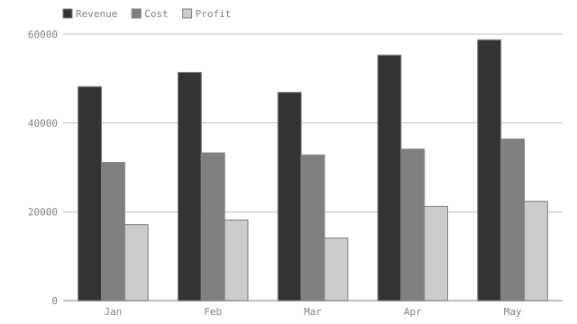
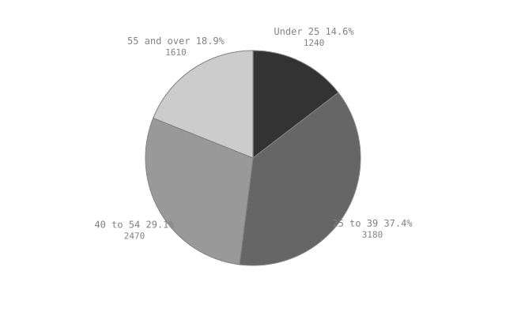

# Quarterly review — a worked example with charts

This document is part of the acceptance suite. It exists to exercise
**generated artifacts**: the two charts below are derived from the tables on
this page, written by `visimark fmt`, and verified by `visimark check`.

Nothing here is an invoice. Charts belong on data that is worth looking at as a
shape — a trend over months, a split across segments — and the worked invoice
is deliberately left alone.

## Sales

Revenue and cost are human input; profit is computed.

| Month | Revenue  | Cost     | Profit   |
|-------|---------:|---------:|---------:|
| Jan   | 48200.00 | 31100.00 | 17100.00 |
| Feb   | 51400.00 | 33250.00 | 18150.00 |
| Mar   | 46900.00 | 32800.00 | 14100.00 |
| Apr   | 55300.00 | 34100.00 | 21200.00 |
| May   | 58750.00 | 36400.00 | 22350.00 |

```vmark #sales
Profit = Revenue - Cost
total_revenue = SUM(Revenue)
total_profit = SUM(Profit)
assert total_profit > 0
chart performance as bar of Revenue, Cost, Profit labelled Month aspect 16:9
```

Revenue across the five months totals **260550.00**<!--vmark=sales.total_revenue-->,
against a profit of **92900.00**<!--vmark=sales.total_profit-->.

<!--vmark=sales.performance-->

The chart takes three series from one sheet, so they share a row count by
construction. It carries an explicit `aspect 16:9`; the pie below takes the
default `16:10`.

## Audience

| Segment     | Headcount |
|-------------|----------:|
| Under 25    |      1240 |
| 25 to 39    |      3180 |
| 40 to 54    |      2470 |
| 55 and over |      1610 |

```vmark #audience
total = SUM(Headcount)
chart mix as pie of Headcount labelled Segment
```

The sample covers **8500**<!--vmark=audience.total--> people.

<!--vmark=audience.mix-->

`Headcount` is a human-written input column with no decimals, so its total
writes bare — the same precision inference every other value gets.

## What `check` guarantees here

`visimark check` proves that both SVGs on disk are exactly what the current
data renders to. Change a `Revenue` cell and the bar chart is `STALE` until
`fmt` regenerates it; delete either file and it is `STALE` as missing. What
`check` does **not** prove is that the picture is a faithful depiction of the
numbers — an artifact's provenance is verifiable, its draughtsmanship is not.
