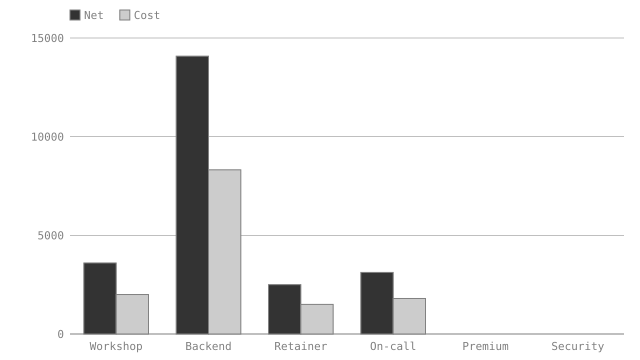
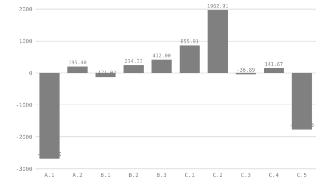
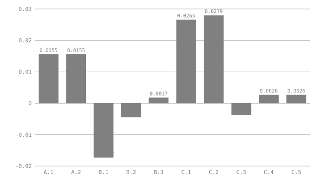

# Deal desk: a quote an agent can negotiate against

A seller is about to send Aperture Labs a quote for a four-line
engagement. Before it goes out, someone wants to ask what the deal could look
like with a bigger order up front, a cross-sold second service, or a premium
support tier. Each of those is a what-if, and each has a limit somewhere in the
business: a margin floor, a discount cap, the buyer's approved budget.

This is the seller's working copy, not the document the buyer sees. It holds
unit costs, so it never leaves the building. The document does two jobs. It
computes the deal, and it states the limits as assertions in the same file, so
that no scenario, whether a person or an agent proposed it, can be reported as
good while breaking one.

## What is invented

Every figure here is made up: the client, the rates, the unit costs, the
limits. The levers are meant to be commitments, not cosmetics. Selling 40 more
backend hours means someone delivers 40 more hours, and a Security review sold
at four days means the Security team spends four days. Nothing in the document
knows whether those people exist. It knows only what the author wrote down:
`security_capacity = 4` is a claim about the team, and `check` is exactly as
truthful as the claims in `#guardrails`. A scenario that looks best on paper
because a capacity constant is stale is a scenario the document will happily
approve. Keeping those constants true is a job for a person, and that is the
reason they are plain scalars in a reviewed file and not values an agent may
vary.

## The levers

Five values are meant to be varied. Each is declared a `param`: the document
holds a default, `check` and `fmt` see only that default, and
`eval --scenario` can supply another for one run without writing anything.

```vmark #levers
param extra_hours    precision 0 = default 0
param volume_disc    precision 3 = default 0%
param prepay_share   precision 2 = default 30%
param crosssell_days precision 0 = default 0
param premium_hours  precision 0 = default 0
vat = 23%
```

| Lever            | Meaning                                                         | Default |
|------------------|-----------------------------------------------------------------|--------:|
| `extra_hours`    | Backend hours added to the first order                          |       0 |
| `volume_disc`    | Discount on every line, offered in return for a bigger order    |      0% |
| `prepay_share`   | Share of the gross invoice due at signature                     |     30% |
| `crosssell_days` | Days of a Security review, a second service sold alongside      |       0 |
| `premium_hours`  | On-call hours upgraded to the premium tier                      |       0 |

## The quote

The `Lever` column ties a line to the parameter that adds to it. `Added` reads
that parameter, `Qty` is the agreed base plus whatever the scenario adds, and a
line with no lever (`-`) never moves. Adding a lever later means adding a row
and one clause to `Added`; nothing else in the document changes.

| Item                      | Lever          | Base |    Rate | UnitCost | Added |  Qty |     Net |    Cost |
|---------------------------|----------------|-----:|--------:|---------:|------:|-----:|--------:|--------:|
| Workshop                 | -              |    2 | 1800.00 |  1000.00 |     0 |    2 |  3600.00 | 2000.00 |
| Backend                  | extra_hours    |   64 |  220.00 |   130.00 |     0 |   64 | 14080.00 | 8320.00 |
| Retainer                 | -              |    1 | 2500.00 |  1500.00 |     0 |    1 |  2500.00 | 1500.00 |
| On-call                  | -              |   12 |  260.00 |   150.00 |     0 |   12 |  3120.00 | 1800.00 |
| Premium                   | premium_hours  |    0 |   80.00 |    40.00 |     0 |    0 |     0.00 |    0.00 |
| Security                 | crosssell_days |    0 | 2000.00 |  1100.00 |     0 |    0 |     0.00 |    0.00 |

```vmark #lines
Added = IF(Lever == "extra_hours", levers.extra_hours, IF(Lever == "premium_hours", levers.premium_hours, IF(Lever == "crosssell_days", levers.crosssell_days, 0)))
Qty   = Base + Added
Net  precision 2 = Qty * Rate * (1 - levers.volume_disc)
Cost precision 2 = Qty * UnitCost

net_total                = SUM(Net)
cost_total               = SUM(Cost)
margin precision 4       = (net_total - cost_total) / net_total
gross_total precision 2  = net_total * (1 + levers.vat)
signature precision 2    = gross_total * levers.prepay_share

chart economics as bar of Net, Cost labelled Item aspect 16:9
```

On the defaults the engagement is **23300.00**<!--vmark=lines.net_total--> PLN
net against **13620.00**<!--vmark=lines.cost_total--> PLN of cost, a margin of
**0.4155**<!--vmark=lines.margin-->. With VAT the invoice is
**28659.00**<!--vmark=lines.gross_total--> PLN, of which
**8597.70**<!--vmark=lines.signature--> PLN falls due at signature.

<!--vmark=lines.economics-->

The two empty groups are the levers: the premium surcharge and the Security
review carry no quantity until a scenario adds one.

## The limits

Each limit is a constant and an assertion. A scenario that breaks one still
evaluates, so the numbers are printed, but `eval` exits `1` and names the
assertion. The constants are the seller's and the buyer's, not the agent's: no
scenario file can change them, because only a declared `param` can be varied
and none of these is one.

```vmark #guardrails
min_margin        = 40%
max_discount      = 10%
max_prepay        = 50%
max_extra_hours   = 40
security_capacity = 4
on_call_hours     = 12
buyer_budget      = 40000.00

assert lines.margin >= min_margin
assert levers.volume_disc >= 0
assert levers.volume_disc <= max_discount
assert levers.prepay_share >= 0
assert levers.prepay_share <= max_prepay
assert levers.extra_hours >= 0
assert levers.extra_hours <= max_extra_hours
assert levers.crosssell_days >= 0
assert levers.crosssell_days <= security_capacity
assert levers.premium_hours >= 0
assert levers.premium_hours <= on_call_hours
assert lines.gross_total <= buyer_budget
```

The seller will not go below a margin of **0.40**<!--vmark=guardrails.min_margin-->
or discount by more than **0.10**<!--vmark=guardrails.max_discount-->. Aperture Labs
will not pay more than **0.50**<!--vmark=guardrails.max_prepay--> of the invoice at
signature, and has approved a gross budget of
**40000.00**<!--vmark=guardrails.buyer_budget--> PLN. The Security team can spare
**4**<!--vmark=guardrails.security_capacity--> days, engineering
**40**<!--vmark=guardrails.max_extra_hours--> more backend hours, and the premium
tier only upgrades the **12**<!--vmark=guardrails.on_call_hours--> on-call hours
Aperture Labs already buys.

## A first scenario, by hand

The person who owns the deal wants more cash at signature and is willing to
give something for it. They write the question down as a scenario, a flat JSON
file whose keys are lever names and whose values are strings:

```json
{ "prepay_share": "50%", "volume_disc": "8%" }
```

```console
$ visimark eval --scenario first.json docs/example-deal-desk.md
lines.margin                  0.3646
lines.signature               13183.14
  ...
scenario: first.json
  levers.volume_disc     0.08  scenario  (default 0)
  levers.prepay_share    0.5   scenario  (default 0.3)
  ASSERT  #guardrails   lines.margin >= min_margin
          0.3646 >= 0.4   is false under scenario (holds on defaults)
```

The signature payment rises from 8597.70 to 13183.14 PLN, and the deal falls
under the margin floor. `eval` exits `1`, prints every value anyway, and says
the assertion holds on the defaults, so the failure belongs to the scenario and
the document was fine before it. Nothing was written: `git status` is clean, and
`check` still sees 30% and 0%.

That is one question, one answer, and about a minute of a person's attention.
The interesting deals sit in a five-dimensional space of combinations, and
finding the best point in it is search work.

## Handing it to agents

The same brief went to three agents, each working alone with the document and
`eval --scenario`, none of them able to write to the file:

> Aperture Labs wants to sign this week. We need at least 17000 PLN in the bank at
> signature. Beyond that, give them as much discount as the guardrails allow:
> discount is the concession we trade for a bigger commitment. Use
> `visimark eval --scenario` to try combinations and read the assertion results.
> Report the best scenario you find and what you learned. Do not edit the
> document. The guardrails are not negotiable.

The brief states a target and a preference. The limits are not in it, because
they are in the document, and an agent that ignored them would see them fail.
Each agent picked a different route.

**Agent A went for cash.** The most direct lever on signature cash is the share
paid at signature, so A started there. At 50% the signature payment is 14329.50
PLN, short of the target, and nothing asserts against that. A pushed the share
to 60% and reached 17195.40, and `eval` failed the prepay ceiling. A stopped:
raising the share cannot reach the target inside the ceiling, so the invoice
itself has to grow.

**Agent B went for volume.** B added the full 40 backend hours, set the prepay
share to 45%, and offered a 5% discount in return. The margin floor failed at
0.3828. B walked the discount down through 3%, which failed at 0.3956, to 2%,
which passed at 0.4017. Backend hours carry about the margin the deal already
has, so they add revenue without adding room to discount.

**Agent C went for mix.** C sold the cross-sold Security review at its four-day
capacity and upgraded all 12 on-call hours. With no discount at all the run
passed at a margin of 0.4265. C then probed the edge: a fifth Security day broke
two limits in one run, the capacity limit and the buyer's budget. Back at four
days, C added the discount, found 5% failed the margin floor at 0.3964 and 4%
passed at 0.4026, and tried a 40% prepay share, which dropped the signature
payment to 15237.04 and missed the target.

Every run, read from `eval --json`:

| Run | extra_hours | volume_disc | prepay_share | crosssell_days | premium_hours |    Gross | Signature | Margin | CashGap | MarginGap | Broken limits | Verdict |
|-----|------------:|------------:|-------------:|---------------:|--------------:|---------:|----------:|-------:|--------:|----------:|---------------|---------|
| A.1 | 0 | 0% | 50% | 0 | 0 | 28659.00 | 14329.50 | 0.4155 | -2670.50 | 0.0155 | none | short of target |
| A.2 | 0 | 0% | 60% | 0 | 0 | 28659.00 | 17195.40 | 0.4155 | 195.40 | 0.0155 | prepay ceiling | rejected |
| B.1 | 40 | 5% | 45% | 0 | 0 | 37508.85 | 16878.98 | 0.3828 | -121.02 | -0.0172 | margin floor | rejected |
| B.2 | 40 | 3% | 45% | 0 | 0 | 38298.51 | 17234.33 | 0.3956 | 234.33 | -0.0044 | margin floor | rejected |
| B.3 | 40 | 2% | 45% | 0 | 0 | 38693.34 | 17412.00 | 0.4017 | 412.00 | 0.0017 | none | valid |
| C.1 | 0 | 0% | 45% | 4 | 12 | 39679.80 | 17855.91 | 0.4265 | 855.91 | 0.0265 | none | valid |
| C.2 | 0 | 0% | 45% | 5 | 12 | 42139.80 | 18962.91 | 0.4279 | 1962.91 | 0.0279 | Security capacity, buyer budget | rejected |
| C.3 | 0 | 5% | 45% | 4 | 12 | 37695.81 | 16963.11 | 0.3964 | -36.89 | -0.0036 | margin floor | rejected |
| C.4 | 0 | 4% | 45% | 4 | 12 | 38092.61 | 17141.67 | 0.4026 | 141.67 | 0.0026 | none | valid |
| C.5 | 0 | 4% | 40% | 4 | 12 | 38092.61 | 15237.04 | 0.4026 | -1762.96 | 0.0026 | none | short of target |

```vmark #runs
signature_target = 17000.00

CashGap   precision 2 = Signature - signature_target
MarginGap precision 4 = Margin - guardrails.min_margin

chart cash   as bar of CashGap   labelled Run aspect 16:9
chart margin as bar of MarginGap labelled Run aspect 16:9
```

<!--vmark=runs.cash-->

<!--vmark=runs.margin-->

Both charts read the table above. Each bar is a distance from a limit, computed
in the `#runs` sheet: `CashGap` is the signature payment minus the 17000 PLN
target, and `MarginGap` is the margin minus the floor. A bar above zero clears
the line and a bar below it does not, so the runs that fail sort themselves out
without reading the table. The routes show up in the shapes. A's bars sit at
the extremes of the cash chart, B's margin bars cross zero as the discount
grows, and C's are the tall ones, with C.4 the thin winner at 0.0026 above the
floor.

Run A.1 and C.5 break no limit and still fail the brief, which is why the verdict
column is separate from the limits column. The document checks the limits. The
target lives in the brief, and reading it against the signature column is the
agent's job.

## The winning scenario

Run C.4 is the best result the three routes produced: it clears the target, it
keeps every guardrail, and it gives Aperture Labs the largest discount of any valid
run.

```json
{
  "crosssell_days": "4",
  "premium_hours": "12",
  "prepay_share": "45%",
  "volume_disc": "4%"
}
```

```console
$ visimark eval --scenario winner.json docs/example-deal-desk.md
lines.net_total               30969.6
lines.cost_total              18500
lines.margin                  0.4026
lines.gross_total             38092.61
lines.signature               17141.67
lines.Qty                     2, 64, 1, 12, 12, 4
  ...
scenario: winner.json
  levers.volume_disc     0.04  scenario  (default 0)
  levers.prepay_share    0.45  scenario  (default 0.3)
  levers.crosssell_days  4     scenario  (default 0)
  levers.premium_hours   12    scenario  (default 0)
```

It exits `0`. B's best valid run, B.3, gave a 2% discount, half of what C.4 gives.

### What the agent reported

Agent C's closing note, lightly edited:

> **Recommendation.** Quote Aperture Labs the Security review at four days, upgrade
> the 12 on-call hours to the premium tier, ask for 45% at signature, and offer
> 4% off. Gross 38092.61 PLN, signature payment 17141.67 PLN, margin 0.4026.
>
> **The prepay lever cannot do this alone.** At the 50% ceiling the base invoice
> pays 14329.50 at signature. The invoice has to grow, and 45% is the lowest
> round share that clears the target once it has.
>
> **Mix buys discount room, volume does not.** Extra backend hours dilute the
> margin toward what the deal already earns, so they leave almost nothing to
> give away. The Security review earns more than the deal's blended margin, so
> each day of it raises the margin and pays for the discount. The volume route
> tops out at 2% and the mix route at 4%.
>
> **The margin is thin.** 0.4026 clears the 0.40 floor by 0.0026. A 5% discount
> fails, and so would a small rise in the Security team's unit cost. Confirm that
> cost before quoting.
>
> **The buyer's budget is the second limit.** The Security capacity would stop
> a fifth day, but the budget would too: that run failed both.
>
> **What I did not do.** I varied only the five declared levers. Unit costs, the
> VAT rate and the limits themselves are not parameters, so I could not assume
> them into a better answer, and I did not try to.

Everything the note says can be checked against the table above.

## Why agents, when a grid would do

Five levers is a small space. Each has a handful of sensible values (0 to 40
hours, 0 to 10 whole percent, five prepay steps, 0 to 4 days, 0 to 12 hours),
which makes 146,575 combinations, and a computer can try every one. A short
script that drives VisiMark's own evaluator over all of them, in one process,
took about 80 seconds. Of those combinations, 6,171 reach the signature target
inside every limit. The largest discount among them is 4%, reached by 234, and
C.4 is one of the 234. So the agents found a global optimum here, not a local
one, and the grid confirms it. For this document the grid is the better tool:
it is exhaustive, it cannot get stuck, and it needs no judgment.

Two things keep the agents in the picture. First, the script reaches into the
engine's internals, because nothing in the command line sweeps a space: `eval`
is a process per scenario, around 130 milliseconds each, so the same grid
through the command would take about five hours. Second, the grid answers the question as written. The agents also
produced the reasoning around the answer, why volume caps the discount at 2%
and the mix at 4%, and that read is what a person acts on. It would matter more
where the space is not enumerable: many more levers, continuous values, a
preference that is hard to write as a formula, or a model too slow to try
everything.

## Conclusions

**The limits made the agents' answers usable.** Nobody had to trust an agent's
statement that a scenario was fine. Each run either exited `0` or named the
assertion it broke, with the values substituted and a note on whether the
document held on its defaults. A report that ignores a failed run would show up
as a claim the run contradicts.

**The agents disagreed about the route and agreed about the limits.** They
differed in what they tried first, and they landed on the same three or four
assertions as the boundaries of the search. The limits were shared and the
strategies were not, which is the property you want from parallel searchers.

**What can move is a choice the author made.** Only declared params can be
varied. The costs, the tax rate and the guardrails are deliberately plain
scalars, so no scenario can wish them away. Deciding which numbers are levers
and which are facts is the modelling work, and the document is where that
decision is written down and reviewed.

**A winning scenario is a proposal.** Nothing in the document changed. To adopt
C.4, a person edits the four defaults, runs `fmt`, and reads the diff, which shows
exactly which figures moved. Or they keep the scenario file next to the deal and
never edit the defaults at all.

**The search is cheap because evaluating is exact and fast.** Each run is a
process that reads a file and prints values. The agents spent their effort on
choosing the next scenario, not on checking the last one.

## Reproducing this

Every figure in the tables and console blocks above came from running
`visimark eval --scenario` on this file. The agent transcripts are written by
hand to show the shape of the workflow, and the routes they describe are ones
these numbers support. A real run may take different steps and reach a
different winner. To check a row, write its lever values to a JSON file, as
strings, and run:

```console
$ visimark eval --scenario row.json docs/example-deal-desk.md
```
