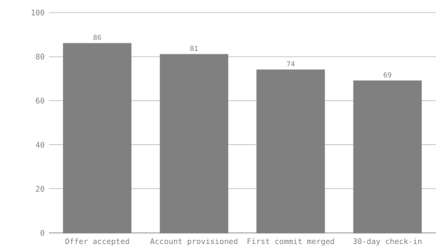

# New-hire onboarding funnel — the deck slide that can't go stale

This is the kind of page that gets exported to a slide once a quarter and then
never touched again while the underlying numbers keep moving. Six months
later someone presents last quarter's funnel as if it were current, because
the picture doesn't announce its own age. Here the chart is a generated
artifact of the document, and `visimark check` refuses to let it disagree
with the table next to it — the safety net is not "remember to re-export",
it is "the build fails if you forgot".

## Q3 cohort

| Stage              | Candidates |
|--------------------|-----------:|
| Offer accepted     |         86 |
| Account provisioned|         81 |
| First commit merged|         74 |
| 30-day check-in    |         69 |

```vmark #funnel
accepted   = MAX(Candidates)
dropoff    = accepted - MIN(Candidates)
retention  = ROUND(MIN(Candidates) / accepted, 4)

chart funnel_shape as bar of Candidates labelled Stage aspect 16:9
```

Of the **86**<!--vmark=funnel.accepted--> people who accepted an offer,
**17**<!--vmark=funnel.dropoff--> did not reach the 30-day check-in, for an
overall retention of **0.80**<!--vmark=funnel.retention--> by day 30.

<!--vmark=funnel.funnel_shape-->

## What happens when Q4 data lands

Someone updates the table for the new cohort — say `30-day check-in` moves
from 69 to 74 as a genuinely better quarter comes in — and, being in a hurry,
commits without re-running `fmt`:

```console
$ visimark check docs/example-onboarding-dashboard.md
  STALE   funnel.dropoff                              17 ≠ 12
  STALE   funnel.retention                          0.80 ≠ 0.86
  STALE   funnel.funnel_shape  artifact is out of date — run `visimark fmt`
  STALE   2 prose anchors bound to the values above

  5 problems (5 stale, 0 errors)
```

The two prose figures are the finding everyone expects — a number in a
sentence disagreeing with the table it summarises. The one that matters for
this example is the third line: `funnel.funnel_shape` is `STALE` too, and for
a different reason than the numbers. `check` never inspects the SVG's
*content* against some rendering of "does this look like a funnel" — it
recomputes the chart from the current table in memory and compares bytes
against the file on disk. The bar chart pasted into last quarter's slide is
therefore provably wrong the moment the table beneath it changes, whether or
not anyone re-opens the deck to look at it.

## Why this is the safety net, not the feature

The chart itself is not the differentiator — plenty of tools draw a funnel
bar chart. What is different is that the chart is **owned** by the document:
`fmt` is the only thing allowed to write
`charts/example-onboarding-dashboard-funnel_shape.svg`, so a hand-edited
"quick fix" to the SVG (moving a bar, relabeling an axis) is caught the same
way a wrong number is — the file on disk stops matching what the declaration
says it should render to. A screenshot pasted into a wiki page has no such
property; it is correct on the day it was taken and silently wrong forever
after. This one is correct for as long as `check` is green, which is a
property CI can enforce and a screenshot cannot.
