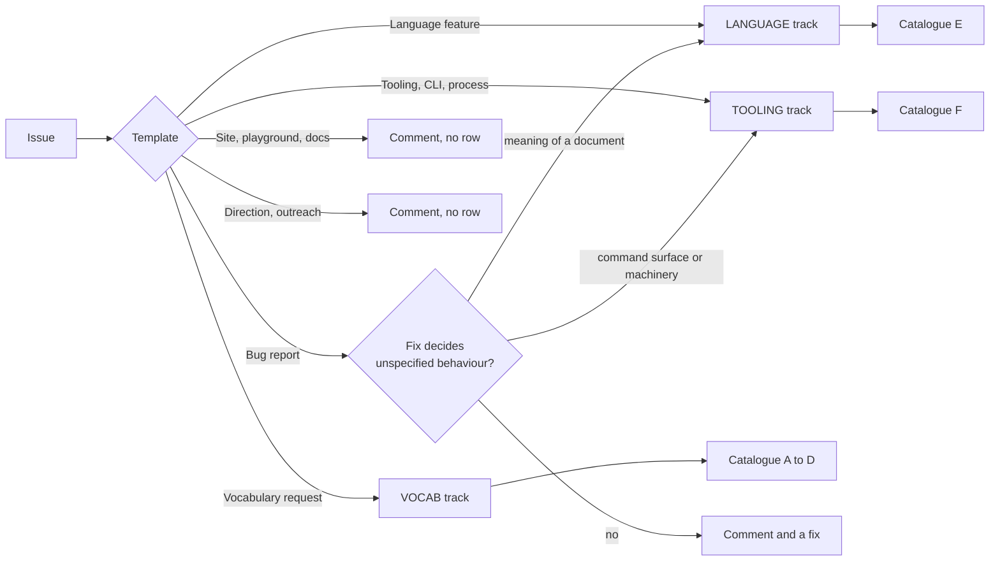
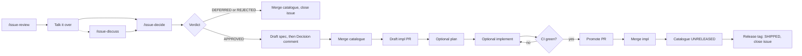
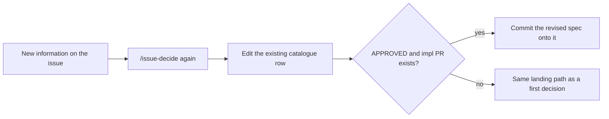

# Reviewing an issue

**An agent drafts; the maintainer decides; the issue comment is the reason.**
An issue is filed on one of six
[templates](../.github/ISSUE_TEMPLATE/), judged against the design doc's
constraints, recorded as a comment that
[`vocabulary-catalogue.md`](vocabulary-catalogue.md) then links, and catalogued
through one pull request to `master`. Three slash commands carry the
mechanics; every judgement call is yours. Commits the agent makes are
attributed per [`.agents/rules/ai-attribution.md`](../.agents/rules/ai-attribution.md).

**The work moves forward, not back.** Each stage exists to leave the next one
with nothing to discover: the template answers what the pre-review would
otherwise have to ask, the pre-review answers what the decision would otherwise
have to weigh, and the decision's spec answers what the implementation would
otherwise have to invent. A question reaching a later stage than it should have
is the failure mode this runbook is shaped to prevent — that is where
contradictions, breaking changes and cruft get in. See
[Front-loading](#front-loading).

## Six kinds, three tracks

The template the issue was filed on names its kind. The kind fixes the track,
the rubric, and — before any judgement is made — whether the issue earns a
catalogue row at all.

| Kind | Track | Row | Rubric |
|------|-------|-----|--------|
| **Vocabulary request** | VOCAB | A–D | The four criteria in the [catalogue preface](vocabulary-catalogue.md#requesting-an-addition), plus precision, errors and overlap with the builtins |
| **Language feature** | LANGUAGE | E | [§1](visimark-design.md#1-purpose) scope, the four [§2](visimark-design.md#2-constraints-that-shaped-the-design) constraints, the shape system, diffability ([§9](visimark-design.md#9-write-back)) |
| **Tooling, CLI, or process** | TOOLING | F | [§1](visimark-design.md#1-purpose) scope, constraint 4 (no ambient dependency), the machine contract, blast radius, reversibility |
| **Bug report** | — | none, or promoted | Reproduce it, name the clause it violates, recommend a fix — a row only if the fix must *decide* something unspecified |
| **Site, playground, or docs** | — | none | Is the claim true, does the example pass `check`, does it promise behaviour that exists |
| **Project direction or outreach** | — | **never** | One falsifiable claim, evidence still current, concrete changes split out onto their own forms |

**The line between LANGUAGE and TOOLING is who consumes the change.** What a
document *means* is section E. What a *machine* sees — the command's options,
exit codes, streams and `--json` shape — is section F, because a CI job depends
on them and no document does. A proposal that moves both is **split into two
issues at review time**, never decided as one: the language half sets the
meaning, the tooling half sets the surface, and each gets its own citable
reason.

**Off-template issues.** A blank issue is classified by the agent into one of
the six kinds and then reviewed on that kind's track — with one exception: a
single vocabulary primitive filed off-template is bounced back to the
[Vocabulary request](../.github/ISSUE_TEMPLATE/vocabulary-request.yml) form,
because the one-primitive rule and the shape rubric live in the form's fields.
An issue too thin to assess gets a comment naming the missing fields — no
pre-review, no PR — until it is filled in.

## The commands

| Command | What it does | What it writes |
|---------|--------------|----------------|
| `/issue-review <n> [--draft]` | Picks the track from the template, parses or analyses the issue, checks it against that track's rubric, runs `visimark check` / `infer` on any motivating document or the before/after CLI session, lists every open fork, drafts a recommendation | A pre-review comment on the issue and a PR adding the row as `NEW` — or, with `--draft`, nothing. A thin or misfiled issue gets only a comment. |
| `/issue-discuss <n>` | Condenses the review conversation you had with the agent in the session into a neutral summary, shows it to you, and posts it only if you approve | A `**Discussion summary**` comment on the issue — nothing else |
| `/issue-decide <n> [notes]` | Reconciles the pre-review with your steer, writes the decision, and lands it. **On `APPROVED` it first drafts the feature spec with you** — a gap hunt and a round of questions — and does nothing public until you call the spec ready; then it offers to draft the implementation plan, and then to execute it | A `Decision:` comment on the issue; the catalogue PR **merged** to `master` with the row at its verdict (the landing commit quotes the decision — a squash commit, the repo's merge policy, or a merge commit if squash is ever disabled instead); the issue **closed** for `DEFERRED` / `REJECTED`, left open for `APPROVED` (and closed automatically once the change ships in a release); and, for `APPROVED`, a **draft** PR carrying the spec (`docs/vocab/<slug>-spec.md` or `docs/design/<slug>-spec.md`) and, if you asked for them, the plan and the implementation — promoted out of draft only once the build and CI are green |

`/issue-discuss` is optional and repeatable — reach for it when the session
argument mattered and the issue thread should carry it before the decision.

## The sequence

1. **`/issue-review <n>`** — add `--draft` first if you want to read the
   analysis before anything is public. Without `--draft` it posts the
   pre-review and opens the `NEW`-row PR on `vocab/issue-<n>-<slug>` (VOCAB) or
   `issue/<n>-<slug>` (LANGUAGE and TOOLING). A no-row kind — a bug that
   decides nothing, a docs change, a direction issue — gets the comment and
   stops there.
2. **Talk it over.** Reply on the issue, or just keep talking to the agent in the
   session — "isn't this `MID`?", "what about the rounding edge?". No command
   needed. If that conversation produced reasoning the thread should keep, run
   **`/issue-discuss <n>`** and approve the summary it drafts.
3. **Optionally merge the `NEW`-row PR** if you want the catalogue to show the
   request as `NEW` before the decision lands. You can also leave it open —
   `/issue-decide` pushes the final row onto the same PR and merges it.
4. **`/issue-decide <n> <your verdict and reason>`** — settles the verdict.
   - On **`DEFERRED` / `REJECTED`**: posts the deciding comment in your voice,
     sets the row's `Status` to `[VERDICT](<comment link>)`, merges the
     catalogue PR (the landing commit quotes the decision), and closes the issue.
   - On **`APPROVED`**: *first* drafts the spec in the house design-doc style
     from the issue, hunts for gaps (unpinned types, unspecified boundaries,
     un-coded errors, acceptance still hand-wavy, and — for a language feature —
     every syntax and edge-semantics fork the issue left open), and puts them to
     you as questions. Nothing is posted or merged until you answer "Spec ready
     to hand off?" with **Ready**. *Then* it posts the deciding comment, merges
     the catalogue PR, and opens a **draft** PR on the `-impl` branch with the
     spec committed. Then it asks whether to **write the implementation plan**
     now — if yes, it drafts the plan, asking you about any decision the spec
     does not settle, and commits it onto the same PR. Last, it asks whether to
     **start implementation** — if yes, it runs `superpowers:executing-plans`
     against the plan (final task always: design doc, `CHANGELOG.md`
     `## Unreleased`, catalogue row moved to the Shipped register as
     `UNRELEASED`, cli-reference), loops check → fix until the local build is
     green, pushes, waits for CI, and only on a full green build **promotes the
     PR out of draft**. The issue stays open and tracks that PR.
   The implementation PR stays a **draft** until CI is green — a blocked or
   red build leaves it draft for you to pick up.
5. **Review and merge the implementation PR** to ship the change — or, if you
   deferred a step, pick it up with `superpowers:writing-plans` /
   `superpowers:executing-plans` against the spec PR. The catalogue row sits in
   the [Shipped register](vocabulary-catalogue.md#shipped) as `UNRELEASED` from
   the moment the implementation merges; the next `vX.Y.Z` tag promotes it to
   `SHIPPED` and closes the issue (see [`releasing.md`](releasing.md)).

## Reopening

The catalogue reopens a `REJECTED` row "only with new information". Add that
information to the issue, then run `/issue-decide <n>` again:

A fresh `Decision:` comment, and a PR that **edits the existing row** rather
than adding a second one. If a re-decision lands on `APPROVED` and the `-impl`
PR already exists, the revised spec is committed onto it rather than opening a
second one.

## What the pre-review checks

**Vocabulary requests** are judged against the four criteria in the
[catalogue preface](vocabulary-catalogue.md#requesting-an-addition) and the
constraints in `visimark-design.md` [§2](visimark-design.md#2-constraints-that-shaped-the-design), [§4](visimark-design.md#4-syntax), [§7](visimark-design.md#7-numeric-semantics) and [§14](visimark-design.md#14-deferred) —
shape system, document-local value, no ambiguity, a real document that needs
it — plus precision behaviour, the inputs it refuses, and overlap with the
builtins, the operator set, and every row already catalogued.

**Language features** are judged against [§1](visimark-design.md#1-purpose)
scope and non-goals, the four [§2](visimark-design.md#2-constraints-that-shaped-the-design)
constraints and the no-plugin rule, the shape system where expressions are
touched, diffability ([§9](visimark-design.md#9-write-back)), the
[§10](visimark-design.md#10-error-taxonomy) taxonomy where a finding is added
or widened, and overlap with existing behaviour and every catalogue row. The
breaking-change question is **does a document that passes `check` today still
pass**.

**Tooling, CLI and process changes** are judged against
[§1](visimark-design.md#1-purpose) scope, constraint 4 — the result must not
start depending on the environment, the clock or the network — the machine
contract (exit codes, streams, `--json` shape), the blast radius while the
change lands, and whether it is reversible. The breaking-change question is
**does an existing CI job, script or composite-Action invocation behave
differently afterwards**. A CLI proposal is not assessable without the before
and after sessions, exit codes included.

The bar from [§14](visimark-design.md#14-deferred) — a real document or a real
scenario needs it — applies to every track, not just vocabulary.

The pre-review comment shows its working and is labelled as automated analysis,
not a decision.

## Front-loading

Every stage is meant to hand the next one a question already answered. The
order is deliberate, and each line is the thing that has actually gone wrong
when it was skipped:

| Stage | Answers | So that |
|-------|---------|---------|
| **The template** | What kind of change this is, what it touches, what it breaks, what documentation it invalidates | The pre-review classifies by reading, not by inferring from prose |
| **`/issue-review`** | Whether the constraints hold, what overlaps, and **every fork the issue left open** | The decision weighs a complete proposal instead of discovering a new tension mid-argument |
| **`/issue-discuss`** | What the session argument settled and what it did not | The decision does not re-run an argument the thread already had |
| **`/issue-decide`** | The spec — every type pinned, every boundary specified, every error given a [§10](visimark-design.md#10-error-taxonomy) code, acceptance written out literally | The plan writer never has to invent semantics, and the implementer never has to invent a plan |
| **The plan** | Which files change, where each piece goes, which docs the final task updates | The implementation is mechanical, and nothing lands undocumented |

Two rules keep it honest. **Open questions must be empty before handoff** — an
unanswered question in a spec becomes an improvised decision in a commit, which
is how contradictions get in. And **a spec states what does not change**, not
only what does; the interaction that nobody wrote down is the one that breaks
two releases later.

<!--vmark:no-formulas-->
