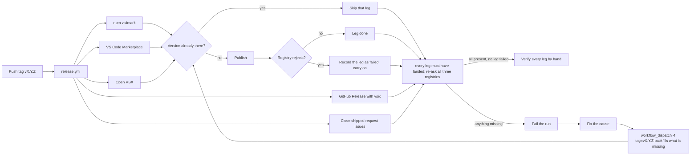
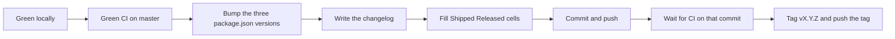

# Releasing VisiMark

**The tag is the only publisher.** Pushing a `vX.Y.Z` tag runs
[`.github/workflows/release.yml`](../.github/workflows/release.yml), which
publishes the engine to npm and the extension to the VS Code Marketplace and
Open VSX, and cuts a GitHub Release. Nobody runs `npm publish`, `vsce publish`
or `ovsx publish` by hand — not once, not "just to unblock it". npm burns a
version number permanently the first time it sees it; `visimark@0.1.0` is the
standing proof, a hand-publish from a work-in-progress tree that cost the number
and left an untraceable tarball on the registry for good.

## What one tag publishes

| Leg | Reads version from | Guard before it publishes |
|-----|--------------------|---------------------------|
| `visimark` on npm, with a provenance attestation | `packages/visimark/package.json` | `npm view visimark@<v>` — skip if already there |
| `visimark-vscode` on the VS Code Marketplace | `editors/vscode/package.json` | `vsce show` — skip if the version is listed |
| `visimark-vscode` on Open VSX | `editors/vscode/package.json` | Open VSX API — skip if the version is there; create the namespace only if it is genuinely missing |
| GitHub Release, with the `.vsix` attached | the tag | needs a tag — the pushed one, or the `tag` input on a `workflow_dispatch` |
| Each request issue whose change ships in this release, closed | the `vocab/issue-<n>-<slug>-impl` or `issue/<n>-<slug>-impl` merge commit is an ancestor of the tag | the issue is still open — a re-run skips what is already closed |

`packages/visimark-lsp` is bundled into the extension and is not published on
its own, but its version moves in lockstep. The root `visimark-monorepo`
package is private and unversioned — leave it alone.

Every leg checks the registry for the exact version and publishes or skips on
that answer. A registry that *rejects* a publish fails the run — it is never
logged as "already done". It no longer fails it *immediately*, though: the legs
are independent and each one is guarded, so a credential problem in one does not
stop the others, the GitHub Release, or the issue bookkeeping. The run records
each leg's outcome and fails at the end. The only ordering that is real is the
`.vsix`: if packaging the extension fails, both marketplace legs and the GitHub
Release are skipped, because there is nothing to publish.

The last step of the run, **every leg must have landed**, asks all three
registries whether the versions are actually there and fails the job if any is
missing. That is what makes a green run mean something — v0.1.1 went green with
both marketplace legs empty, and v0.1.3 shipped npm only. It is not a substitute
for [Verify every leg](#verify-every-leg), which also covers the provenance
attestation and the GitHub Release.



A `workflow_dispatch` without a `tag` cuts no GitHub Release and closes no
issues — it has no tag to point at, and it says so in the run log. Pass
`-f tag=vX.Y.Z` to backfill those two as well; the run then checks that tag out
and builds from it.

## Before you tag

1. **Green locally**, from a clean tree on `master`:
   ```bash
   bun install --frozen-lockfile
   bun run typecheck
   bun test
   bun run build
   ```
2. **Green in CI on the commit you will tag.** The `ci` and `dogfood` workflows
   run on every push to `master`. Wait for both before tagging — `release.yml`
   checks out the tag, not your working tree, so an unpushed or red commit
   cannot be in the release.
3. **Bump the version** to the same `X.Y.Z` in all four version-carrying files:
   ```
   packages/visimark/package.json
   packages/visimark-lsp/package.json
   editors/vscode/package.json
   action.yml          # the `version` input's default
   ```
   They must match each other and the tag exactly. `action.yml` is in the list
   because its default is what a consumer's `npx` installs: leave it behind and
   everyone who pinned the new Action ref quietly keeps running the old engine.
   No hand-run `grep` needed any more — `ci.yml`'s "every version-carrying file
   must agree" step fails the build if you miss one, so step 6's green CI is
   the confirmation.
4. **Write the changelog** — see [Preparing the changelog](#preparing-the-changelog).
5. **Promote the shipped rows.** In
   [`docs/vocabulary-catalogue.md`](vocabulary-catalogue.md)'s
   [Shipped register](vocabulary-catalogue.md#shipped), every row with an
   empty **Released** cell is about to ship. For each: confirm the behaviour is
   specified where it belongs — a vocabulary primitive in `visimark-design.md`
   [§4](visimark-design.md#4-syntax), a language feature in the section it
   changed, a tooling / process change in its own doc — then set its
   **Released** cell to
   `[vX.Y.Z](https://github.com/michal-niedzwiedzki/visimark/releases/tag/vX.Y.Z)`.
   A filled **Released** cell is what makes the row `SHIPPED` rather than
   `UNRELEASED` — there is no separate status word. Commit with the changelog,
   or as its own `docs: promote <names> to SHIPPED`. The issues themselves are
   closed by `release.yml` after the tag — do not close them here.
6. **Commit** as `chore: release vX.Y.Z`, push to `master`, and wait for CI on
   that commit to pass.
7. **Tag and push the tag** — and only now:
   ```bash
   git tag vX.Y.Z
   git push origin vX.Y.Z
   ```



## Preparing the changelog

Two files. Both are read by machines at release time, so both are part of the
release, not an afterthought.

- **[`CHANGELOG.md`](../CHANGELOG.md)** — the whole file becomes the GitHub
  Release body, so it has to read correctly top-to-bottom as of the tag.
  - Keep a `## Unreleased` section at the top and add each user-facing change
    to it *as you make it*, under `Added` / `Changed` / `Fixed` / `Removed`.
  - At release time, rename `## Unreleased` to `## X.Y.Z - YYYY-MM-DD` and open
    a fresh empty `## Unreleased` above it.
  - The date is ISO 8601, `YYYY-MM-DD` — the project's own rule, and `fmt
    --fix-dates` will not rescue a changelog.
  - Add the `[X.Y.Z]: https://github.com/michal-niedzwiedzki/visimark/releases/tag/vX.Y.Z`
    link reference at the bottom.
- **[`editors/vscode/CHANGELOG.md`](../editors/vscode/CHANGELOG.md)** — shown on
  the extension's Marketplace page. Keep it to what an extension user sees:
  editor features, settings, fixes. Same version, same date.

If a change only touches CI, the build, or the tests, it does not need a
changelog line — unless a consumer can observe it (the provenance attestation
did, so it got one).

## Verify every leg

`release.yml`'s own final step now asserts all three registries have the
version, so a green run is no longer the empty signal it was for v0.1.1. It
still does not check the provenance attestation or the GitHub Release, and
`check` refuses to call a formula-free table verified — hold a release to the
same bar. After the run, for the version you released:

```bash
# This is also the Action's pinned default (ci.yml asserts the two agree), so
# it doubles as proof that a consumer's `npx visimark@<default>` can resolve.
# CI proves the number matches the manifests; only npm proves it was ever
# published, and v0.1.0 is the standing reminder that those are different
# questions.
npm view visimark@X.Y.Z version
npm view visimark@X.Y.Z dist.attestations            # provenance must be present
npx @vscode/vsce show visimark-michal-niedzwiedzki.visimark-vscode
curl -sS -o /dev/null -w '%{http_code}\n' \
  https://open-vsx.org/api/michal-niedzwiedzki/visimark-vscode/X.Y.Z   # expect 200
gh release view vX.Y.Z
```

A first Marketplace publish for a new publisher can sit in verification for a
while — check the publisher hub, not just `vsce show`, before calling it
missing.

## If a leg fails or was skipped wrongly

Fix the cause — a missing secret, an unverified publisher, a namespace that was
never created — then re-run:

```bash
gh workflow run release.yml -f tag=vX.Y.Z
```

`workflow_dispatch` re-checks every registry and backfills only what is missing.
With `tag`, it checks that tag out, so the versions it publishes are the tagged
ones and the GitHub Release and the request-issue bookkeeping are backfilled
too. Without `tag` it runs from the default branch against the versions
currently in the manifests, repairs the three publish legs only, and warns in
the log that it skipped the other two. **Never bump the version just to
re-trigger the pipeline.**

## Rules that bite

| Rule | Consequence if ignored |
|------|------------------------|
| The tag is the only publisher. No hand-run `npm publish` / `vsce publish` / `ovsx publish`. | npm keeps the version number forever on the first publish it sees. `visimark@0.1.0` is a mis-publish that can never be reissued. |
| All three `package.json` versions equal the tag, exactly. | One tag then publishes mismatched version numbers, or a leg fails mid-release with the others already out. |
| The changelog entry is written, dated and merged **before** the tag. | The GitHub Release body is built from `CHANGELOG.md` at the tagged commit — a tag ahead of the changelog ships the previous version's notes. |
| The Shipped-register **Released** cells are filled **before** the tag (step 5). | The released `vocabulary-catalogue.md` shows shipped primitives as still pending, while `release.yml` closes their issues — the catalogue and the tracker disagree. |
| Tag a commit already on `origin/master` with green `ci` and `dogfood`. | `release.yml` builds from the tag. Uncommitted, unpushed or red work is silently not in the release. |
| `action.yml`'s `version` default is bumped with the manifests. | Every consumer who pins the new Action ref keeps running the previous engine, with nothing at run time to tell them. Nothing fails; it just quietly verifies with the old code. |
| Changelog dates are ISO 8601, `YYYY-MM-DD`. | The project's own date rule, unenforced here because nothing runs `check` with date repair on the changelog. |
| Never retag, force-push a tag, or `npm unpublish` to tidy a botched release. | It rewrites history to look like the pipeline did something it did not. Bump to the next patch and let the record stand — the move `infer`'s near-miss refusal exists to enforce, applied to the release instead of a spreadsheet. |
| A green `release` run is not a fully released package. Verify each leg. | The run's final step asserts the three registries have the version, but nothing automated checks the provenance attestation or the GitHub Release. The v0.1.1 run reported success with npm and the GitHub Release done and both extension registries empty — that gap is closed; the remaining ones are yours. |

## Secrets the workflow needs

Set as repository secrets (`gh secret set …`):

| Secret | Used by | Notes |
|--------|---------|-------|
| `NPM_TOKEN` | npm publish | Automation token, publish scope. Provenance also needs `id-token: write`, which the workflow already declares. |
| `VSCE_PAT` | Marketplace publish | Azure DevOps PAT for the `visimark-michal-niedzwiedzki` publisher, Marketplace → Manage scope. |
| `OVSX_PAT` | Open VSX publish | open-vsx.org access token. The `michal-niedzwiedzki` namespace must exist — `ovsx create-namespace` once, by hand, if the workflow's check ever reports it missing. |

<!--vmark:no-formulas-->
