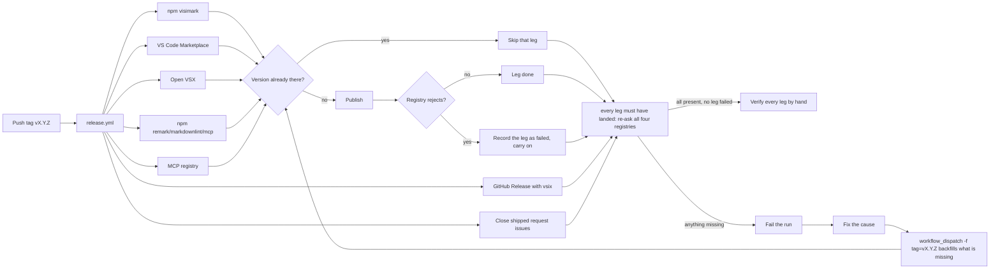
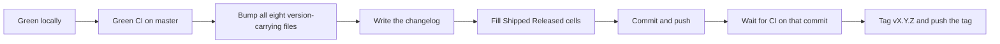

# Releasing VisiMark

**The tag is the only publisher.** Pushing a `vX.Y.Z` tag runs
[`.github/workflows/release.yml`](../.github/workflows/release.yml), which
publishes the engine to npm and the extension to the VS Code Marketplace and
Open VSX, and cuts a GitHub Release. Nobody runs `npm publish`, `vsce publish`
or `ovsx publish` by hand — not once, not "just to unblock it". npm burns a
version number permanently the first time it sees it; `visimark@0.1.0` is the
standing proof, a hand-publish from a work-in-progress tree that cost the number
and left an untraceable tarball on the registry for good.

For where every artifact is actually listed today — registries fed
automatically by this tag, one-time manual submissions already sent, and
directories still prepared but not sent — see
[`docs/distribution.md`](distribution.md).

## What one tag publishes

| Leg | Reads version from | Guard before it publishes |
|-----|--------------------|---------------------------|
| `visimark` on npm, with a provenance attestation | `packages/visimark/package.json` | `npm view visimark@<v>` — skip if already there |
| `remark-lint-visimark` on npm, with a provenance attestation | `packages/remark-visimark/package.json` | `npm view remark-lint-visimark@<v>` — skip if already there |
| `markdownlint-rule-visimark` on npm, with a provenance attestation | `packages/markdownlint-visimark/package.json` | `npm view markdownlint-rule-visimark@<v>` — skip if already there |
| `visimark-mcp` on npm, with a provenance attestation | `packages/visimark-mcp/package.json` | `npm view visimark-mcp@<v>` — skip if already there |
| `io.github.michal-niedzwiedzki/visimark` on the MCP registry | `server.json`, rewritten from the tag | `GET /v0/servers?search=visimark` — skip if this version is listed; runs only if the npm leg succeeded, since the entry points at the npm package, then waits (up to ~9 minutes) for npm to actually list the version — the registry validates against npm and refuses an entry npm cannot yet serve — and retries a 5xx from the registry, never a 4xx |
| `visimark-vscode` on the VS Code Marketplace | `editors/vscode/package.json` | `vsce show` — skip if the version is listed |
| `visimark-vscode` on Open VSX | `editors/vscode/package.json` | Open VSX API — skip if the version is there; create the namespace only if it is genuinely missing |
| GitHub Release, with the `.vsix` attached | the tag | needs a tag — the pushed one, or the `tag` input on a `workflow_dispatch`. The body is that version's own section of `CHANGELOG.md` (extracted by `scripts/changelog-section.ts`), followed by GitHub's generated "What's Changed" list |
| Each request issue whose change ships in this release, closed | the `vocab/issue-<n>-<slug>-impl` or `issue/<n>-<slug>-impl` merge commit is an ancestor of the tag | the issue is still open — a re-run skips what is already closed |

`packages/visimark-lsp` is bundled into the extension and is not published on
its own, but its version moves in lockstep. The root `visimark-monorepo`
package is private and unversioned — leave it alone.

Every leg checks the registry for the exact version and publishes or skips on
that answer. A registry that *rejects* a publish fails the run — it is never
logged as "already done". It no longer fails it *immediately*, though: the legs
are independent and each one is guarded, so a credential problem in one does not
stop the others, the GitHub Release, or the issue bookkeeping. The run records
each leg's outcome and fails at the end. The only ordering that is real is the
`.vsix`: if packaging the extension fails, both marketplace legs and the GitHub
Release are skipped, because there is nothing to publish.

The last step of the run, **every leg must have landed**, asks all four
registries — npm, the VS Code Marketplace, Open VSX and
`registry.modelcontextprotocol.io` — whether the versions are actually there and fails the job if any is
missing. That is what makes a green run mean something — v0.1.1 went green with
both marketplace legs empty, and v0.1.3 shipped npm only. It is not a substitute
for [Verify every leg](#verify-every-leg), which also covers the provenance
attestation and the GitHub Release.


```mermaid
flowchart LR
  tag[Push tag vX.Y.Z] --> run[release.yml]
  run --> npm[npm visimark]
  run --> npmplugins[npm remark/markdownlint/mcp]
  run --> mcpreg[MCP registry]
  run --> vsce[VS Code Marketplace]
  run --> ovsx[Open VSX]
  run --> ghrel[GitHub Release with vsix]
  run --> closeIss[Close shipped request issues]
  npm --> present{"Version already there?"}
  vsce --> present
  ovsx --> present
  npmplugins --> present
  mcpreg --> present
  present -->|yes| skip[Skip that leg]
  present -->|no| pub[Publish]
  pub --> rejected{"Registry rejects?"}
  rejected -->|yes| legfail[Record the leg as failed, carry on]
  rejected -->|no| ok[Leg done]
  skip --> gate["every leg must have landed: re-ask all four registries"]
  ok --> gate
  legfail --> gate
  ghrel --> gate
  closeIss --> gate
  gate -->|all present, no leg failed| verify[Verify every leg by hand]
  gate -->|anything missing| fail[Fail the run]
  fail --> fix[Fix the cause]
  fix --> dispatch["workflow_dispatch -f tag=vX.Y.Z backfills what is missing"]
  dispatch --> present
```

A `workflow_dispatch` without a `tag` cuts no GitHub Release and closes no
issues — it has no tag to point at, and it says so in the run log. Pass
`-f tag=vX.Y.Z` to backfill those two as well; the run then checks that tag out
and builds from it.

### What the run refuses, and how to rehearse it

Before any leg publishes, given a tag, the run fails unless:

- the tag equals `packages/visimark`'s version at that commit — `v0.1.9` was
  once pushed on a 0.1.8 tree, every leg found its version "already there", and
  the run still cut a GitHub Release; and
- the tagged commit is an ancestor of `origin/master`.

Runs are serialised per tag (`concurrency`, `cancel-in-progress: false`): a
second push or dispatch for the same tag queues behind the first instead of
racing it to the registries.

To rehearse without publishing, dispatch with `dry_run`:

```bash
gh workflow run release.yml -f tag=vX.Y.Z -f dry_run=true
```

It builds, tests, runs the tag checks above, runs `npm publish --dry-run` for
the four packages, packages the `.vsix` and extracts the release notes. It
publishes nothing, cuts no GitHub Release, closes no issues, and skips **every
leg must have landed** (there is nothing to land); a *dry run verdict* step
fails the run if any rehearsed step did not succeed. It runs `npm publish`
without `--provenance`, so it does not rehearse the attestation.

## Release order

Core first, plugin second, and never the other way round. The plugin bundles
the engine, so its changelog says "Bundles engine X.Y.Z." and that version has to
be on the registries before a plugin release names it — #286 was once merged
before core had shipped.

1. Merge the core release commit (`chore: release vX.Y.Z`) and wait for `ci`
   and `dogfood` on it.
2. Tag it with `scripts/release-tag.sh vX.Y.Z` and wait for `release.yml`.
3. Run `scripts/verify-release.sh vX.Y.Z` ([Verify every leg](#verify-every-leg)).
4. Only now merge the plugin release PR, and wait for `ci` on `master`.
5. Tag it with `scripts/release-tag.sh X.Y.Z` and wait for
   `obsidian-release.yml`.
6. Check the release page has `main.js`, `manifest.json` and `styles.css`, and
   that the attestation verifies (see below).

Pushing a tag is the maintainer's action; an agent opens the PRs, watches the
runs and verifies, and does not tag unless asked.

## Releasing the Obsidian plugin

**A separate, bare-version tag — not `vX.Y.Z`.** The plugin's version is its
own (`editors/obsidian/manifest.json`, not tied to the engine's — see
`editors/obsidian/CHANGELOG.md`'s own header), and the community registry and
BRAT both match a GitHub Release's tag against that version *exactly*, with
no `v` prefix. Pushing `0.2.0` (not `v0.2.0`) runs
[`.github/workflows/obsidian-release.yml`](../.github/workflows/obsidian-release.yml),
which fails if that tag disagrees with the manifest, builds `main.js`, and
attaches `main.js`, `manifest.json` and `styles.css` to a GitHub Release cut
against the same tag, after recording a build-provenance attestation for
`main.js` and `styles.css` (the community scanner's Scorecard looks for one).
Before tagging, `bun run --filter visimark-obsidian lint` must show no errors.
The workflow also fails unless the newest dated entry in
`editors/obsidian/CHANGELOG.md` says "Bundles engine X." for the engine version
in `packages/visimark` at the tagged commit
(`scripts/check-obsidian-engine-line.ts`). That check is deliberately not in
`ci.yml`: a core-only bump would turn every PR red until the plugin was
re-released. The release body is that version's own section of the plugin
changelog. The workflow cannot fire from the same push that runs
`release.yml`'s own `v*`-tagged release: the two tag schemes cannot collide,
since every tag `release.yml` creates starts with `v` and this workflow's
trigger requires the first character to be a digit.

This is [Option C of `docs/design/obsidian-release-plan.md`](design/obsidian-release-plan.md),
decided 2026-09-27. It has no `workflow_dispatch`-free backfill loop, no
multi-registry verification gate, and no issue-closing bookkeeping the way
`release.yml` does — the plugin publishes to exactly one place (a GitHub
Release) rather than four registries, so there is nothing analogous to
verify afterward beyond checking the release exists with its three assets.
`workflow_dispatch` with a required `tag` input covers a backfill by hand.

**Keeping the root copies in step.** The community registry reads
`manifest.json` from the repository's root on the default branch, while the
build and the release read `editors/obsidian/`. The root `manifest.json` and
`versions.json` must stay byte-equal to the `editors/obsidian/` copies; `ci.yml`
fails ("release metadata must agree") when they drift, so copy both in the plugin
release commit.

### Submitting to the community registry

Pull requests to `obsidianmd/obsidian-releases` are disabled; the registry is the
**community.obsidian.md** portal. Submitting is a by-hand, one-time step, not
something a tagged release triggers:

1. Sign in at community.obsidian.md and link the GitHub account.
2. Plugins, then New plugin; enter the repository URL and confirm the developer
   policies.
3. The portal takes `manifest.json` from the default branch's root (which is
   why the root copy exists, and it makes the scanner treat this whole monorepo
   as the plugin) and reviews the plugin automatically.
4. Answer the review's feedback by publishing a **new release with an
   incremented version** — each fix is a normal plugin release, in the order
   above.

What the scanner looks at, learned from 0.2.0 to 0.2.2:

- It lints with `eslint-plugin-obsidianmd`. Errors fail
  `bun run --filter visimark-obsidian lint`; three warnings are known and
  accepted (see the plugin changelog). Warnings show on the public Scorecard.
- It lints the whole repository, so about twenty warnings from `packages/*` and
  `editors/vscode` appear on the Scorecard too. Known, accepted.
- It looks for a **build-provenance attestation** on `main.js` and `styles.css`.
  `obsidian-release.yml` makes one from the same bytes it uploads. Verify with
  `gh attestation verify <file> --repo michal-niedzwiedzki/visimark`, which
  prints nothing on success — check the exit code is 0.
- `authorUrl` must be the author's profile, not the plugin repository (0.2.1
  was flagged for this).
- The README must say what the plugin touches (vault enumeration, clipboard).

## Before you tag

1. **Green locally**, from a clean tree on `master`:
   ```bash
   bun install --frozen-lockfile
   bun run typecheck
   bun test
   bun run build
   ```
2. **Green in CI on the commit you will tag.** `scripts/release-tag.sh` (step 7)
   refuses if it is not, but knowing first saves a round trip. The `ci` and `dogfood` workflows
   run on every push to `master`. Wait for both before tagging — `release.yml`
   checks out the tag, not your working tree, so an unpushed or red commit
   cannot be in the release.
3. **Bump the version** to the same `X.Y.Z` in all eight version-carrying files.
   `bun scripts/prepare-release.ts [FIX|MINOR|MAJOR|X.Y.Z]` does this and step 4's
   changelog turnover in one go; omitting the argument defaults to `FIX`. A bump
   word computes the next version from the one in `packages/visimark/package.json`
   (`MINOR` resets the patch to `0`, `MAJOR` resets minor and patch); an explicit
   `X.Y.Z` is the escape hatch for the odd case, such as the first `1.0.0`. Either
   way the tool refuses if `## Unreleased` is empty, if the resulting version is
   not newer, or if the bump is not earned: a `MINOR` needs a `### Added` entry
   under `## Unreleased`, a `MAJOR` needs `### Removed` (a breaking change) —
   `### Fixed` / `### Changed` alone never justifies more than `FIX`, so "bug
   fix" or "article added" content can't accidentally move the minor or major
   number. It writes nothing on any refusal; read the diff and rewrite the
   extension changelog's placeholder line afterwards. By hand, the files are:
   ```
   packages/visimark/package.json
   packages/visimark-lsp/package.json
   editors/vscode/package.json
   action.yml                                  # the `version` input's default
   scripts/precommit-visimark-check.sh         # both visimark@ pins inside it
   packages/remark-visimark/package.json       # its own version AND its visimark dependency pin
   packages/markdownlint-visimark/package.json # its own version AND its visimark dependency pin
   packages/visimark-mcp/package.json          # its own version AND its visimark dependency pin
   ```
   They must match each other and the tag exactly. `action.yml` is in the list
   because its default is what a consumer's `npx` installs: leave it behind and
   everyone who pinned the new Action ref quietly keeps running the old engine.
   `scripts/precommit-visimark-check.sh` joins them for the same reason — it is
   what a consumer's pinned `pre-commit` `rev:` actually runs. No hand-run
   `grep` needed any more — `ci.yml`'s "every version-carrying file must agree"
   step fails the build if you miss one of them, so step 6's green CI is the
   confirmation.

   `server.json` is **not** in this list, and does not need to be: the
   MCP-registry leg rewrites its two version fields from the tag before it
   publishes, so it cannot go stale and cannot register an entry pointing at a
   version other than the one that just shipped.
4. **Write the changelog** — see [Preparing the changelog](#preparing-the-changelog).
   `ci.yml`'s "every release must have a changelog entry" step fails the build if
   `CHANGELOG.md` or `editors/vscode/CHANGELOG.md` has no dated
   `## X.Y.Z - YYYY-MM-DD` heading for its own manifest's version, so step 6's
   green CI is the confirmation. It checks that the entry exists, not that it is
   right.
5. **Promote the shipped rows.** In
   [`docs/vocabulary-catalogue.md`](vocabulary-catalogue.md)'s
   [Shipped register](vocabulary-catalogue.md#shipped), every row with an
   empty **Released** cell is about to ship. For each: confirm the behaviour is
   specified where it belongs — a vocabulary primitive in `visimark-design.md`
   [§4](visimark-design.md#4-syntax), a language feature in the section it
   changed, a tooling / process change in its own doc — then set its
   **Released** cell to
   `[vX.Y.Z](https://github.com/michal-niedzwiedzki/visimark/releases/tag/vX.Y.Z)`.
   A filled **Released** cell is what makes the row `SHIPPED` rather than
   `UNRELEASED` — there is no separate status word. Commit with the changelog,
   or as its own `docs: promote <names> to SHIPPED`. The issues themselves are
   closed by `release.yml` after the tag — do not close them here.
6. **Commit** as `chore: release vX.Y.Z`, push to `master`, and wait for CI on
   that commit to pass.
7. **Tag and push the tag** — and only now:
   ```bash
   scripts/release-tag.sh vX.Y.Z
   ```
   It refuses unless you are on `master`, the tree is clean, `HEAD` equals
   `origin/master`, the tag matches the manifest version and is unused (locally
   and on origin), and the latest `ci` and `dogfood` runs on `master` for
   `HEAD` are green. Then it creates the tag (signed, if your git config signs
   tags) and pushes it. For the plugin, pass the bare version: `X.Y.Z`.


```mermaid
flowchart LR
  local[Green locally] --> ci[Green CI on master]
  ci --> bump[Bump all eight version-carrying files]
  bump --> cl[Write the changelog]
  cl --> promo[Fill Shipped Released cells]
  promo --> commit[Commit and push]
  commit --> wait[Wait for CI on that commit]
  wait --> tag[Tag vX.Y.Z and push the tag]
```

## Preparing the changelog

Two files. Both are read by machines at release time, so both are part of the
release, not an afterthought. CI checks that each has an entry for the release;
it does not check what the entry says.

- **[`CHANGELOG.md`](../CHANGELOG.md)** — the release's own section becomes the
  GitHub Release body (`scripts/changelog-section.ts` extracts everything under
  the version's heading, up to the next `##`), so that section has to read
  correctly on its own. The run fails if the heading is missing or empty.
  - Keep a `## Unreleased` section at the top and add each user-facing change
    to it *as you make it*, under `Added` / `Changed` / `Fixed` / `Removed`.
  - At release time, rename `## Unreleased` to `## X.Y.Z - YYYY-MM-DD` and open
    a fresh empty `## Unreleased` above it.
  - The date is ISO 8601, `YYYY-MM-DD` — the project's own rule, and `fmt
    --fix-dates` will not rescue a changelog.
  - Add the `[X.Y.Z]: https://github.com/michal-niedzwiedzki/visimark/releases/tag/vX.Y.Z`
    link reference at the bottom.
- **[`editors/vscode/CHANGELOG.md`](../editors/vscode/CHANGELOG.md)** — shown on
  the extension's Marketplace page.
  - Every release gets a dated `## X.Y.Z - YYYY-MM-DD` entry, even when it is
    one line: "No editor-visible changes. Bundles engine X.Y.Z." Same version,
    same date as the root file.
  - An entry lists only what an extension user sees: diagnostics, hover,
    highlighting, completion, settings, fixes. A language change belongs there
    only if the extension surfaces it.
  - To decide that, remember the language server calls the engine's `analyze()`
    (`packages/visimark-lsp/src/analysis.ts`). An engine finding reaches the
    editor as a diagnostic unless the language server maps it away, so a new or
    widened finding usually belongs here. CI cannot check this; you do.
  - `## Unreleased` is optional in this file. Write the entry when you cut the
    release.
- **[`editors/obsidian/CHANGELOG.md`](../editors/obsidian/CHANGELOG.md)** — the
  plugin has its own version, so it has its own entry, and it becomes the plugin
  release's body. End each entry with "Bundles engine X.Y.Z." — the plugin
  release run checks it against the engine in the tree.

If a change only touches CI, the build, or the tests, it does not need a
changelog line — unless a consumer can observe it (the provenance attestation
did, so it got one).

## Verify every leg

`release.yml`'s own final step asserts all four registries have the
version, so a green run is no longer the empty signal it was for v0.1.1. It
still does not check the provenance attestation, the GitHub Release or that the
server starts, and `check` refuses to call a formula-free table verified — hold
a release to the same bar. After the run:

```bash
scripts/verify-release.sh vX.Y.Z
```

It is read-only, and needs only `curl`, `gh` and `node` or Bun. It checks:

- all four npm packages are at that version **and** carry a provenance
  attestation (`dist.attestations`). CI proves the version number matches the
  manifests; only npm proves it was ever published, and `visimark@0.1.0` is the
  standing reminder that those are different questions;
- the MCP registry lists the version. An agent discovers the server there and
  nowhere else, so an entry that is absent or stuck on the previous version is a
  release that reached no one;
- the VS Code Marketplace and Open VSX list the extension version;
- `gh release view vX.Y.Z` finds the release;
- the published MCP server starts, from the registry rather than a tarball you
  built: `npx -y visimark-mcp@X.Y.Z --nope` and `bunx visimark-mcp@X.Y.Z --nope`
  must each exit 2 with a usage line. It runs whichever of the two is installed
  and says which it skipped, so run it on a machine with each.

A server that cannot start is not visible in any registry check. If either
form fails to resolve `visimark`, read
[Publishing a new package for the first time](#publishing-a-new-package-for-the-first-time)
— the lockstep note there is the usual cause.

A first Marketplace publish for a new publisher can sit in verification for a
while — check the publisher hub, not just `vsce show`, before calling it
missing.

## If a leg fails or was skipped wrongly

Fix the cause — a missing secret, an unverified publisher, a namespace that was
never created, an npm name that is not yours ([first
release](#publishing-a-new-package-for-the-first-time)) — then re-run:

```bash
gh workflow run release.yml -f tag=vX.Y.Z
```

`workflow_dispatch` re-checks every registry and backfills only what is missing.
With `tag`, it checks that tag out, so the versions it publishes are the tagged
ones and the GitHub Release and the request-issue bookkeeping are backfilled
too. Without `tag` it runs from the default branch against the versions
currently in the manifests, repairs the **publish** legs only — the four npm
packages, the MCP registry entry, the Marketplace and Open VSX — and warns in
the log that it skipped the two tag-gated ones, the GitHub Release and the
request-issue bookkeeping. **Never bump the version just to
re-trigger the pipeline.**

## Publishing a new package for the first time

Everything above assumes each leg has published before. A package's **first**
release is the one where a leg can fail for a reason no later release will ever
hit again, and the two that matter are ordering and ownership. This section
exists because `visimark-mcp` is the first package added to this pipeline since
the ordering rules were written down, and the next one will want the same list.

**1. The name must be free, or already yours.** `npm publish` on a name someone
else holds fails the leg outright — and unlike a version, a name cannot be
retried under a different number. Check before you tag, not after:

```bash
npm view <name> version    # "npm error 404" is what you want to see
```

**2. A leg that depends on another must run after it.** `release.yml` publishes
in dependency order — engine, then the remark plugin, the markdownlint rule and
`visimark-mcp`, then the MCP registry entry. Each of the latter pins the engine
exactly, and the registry entry points at an npm package that has to exist for
the listing to resolve. If you add a leg, put it after everything it names.

**3. The package must work against the *published* engine, not just the tree.**
This is the one that bit. `visimark-mcp` resolves its exact `visimark` pin from
the registry at install time, so it inherits whatever that published engine is
— including bugs already fixed on `master`. `visimark@0.1.7` carries the
[#170](https://github.com/michal-niedzwiedzki/visimark/issues/170) `bun`
exports condition, so a `visimark-mcp` released against it would fail
`bun add -g` for every user while passing every check in this repository.

Publishing both from one tag is what makes this safe, and it is why the
lockstep pin is exact rather than a caret. **Never publish a dependent package
against an engine version older than the tag**, however convenient it looks.

**4. An npm package that is listed on the MCP registry needs `mcpName`.** The
registry validates the entry against the npm package and refuses one whose
`package.json` does not carry `"mcpName"` equal to `server.json`'s `name`.
`visimark-mcp@0.1.9` shipped without it, its registry leg was refused, npm
versions are immutable, and the fix had to ship as 0.1.10 — 0.1.9 stays
unlisted on the registry for good. `ci.yml` now fails when the two disagree
(`scripts/check-mcp-name.ts`), so add the field in the same PR that adds the
package.

**5. A new registry needs its ownership settled once.** For npm that is the
`NPM_TOKEN` scope; for Open VSX the workflow creates the namespace on first
publish. For the MCP registry, `io.github.<owner>/<name>` is owned by the
GitHub identity that publishes it, proven by OIDC — so there is nothing to
claim in advance, but the first run is the first time that is tested. If it
fails, read the leg's log before assuming a credential problem: the guard
`GET /v0/servers?search=` runs first, and a network failure there looks like a
publish failure.

**6. Verify the first release by hand, even though the gate is green.** Run
`scripts/verify-release.sh` (see [Verify every leg](#verify-every-leg)) on a machine
with each runtime, so both smoke commands run. The final gate proves a version is *listed*; only running it
proves it *starts*.

## Rules that bite

| Rule | Consequence if ignored |
|------|------------------------|
| The tag is the only publisher. No hand-run `npm publish` / `vsce publish` / `ovsx publish`. | npm keeps the version number forever on the first publish it sees. `visimark@0.1.0` is a mis-publish that can never be reissued. |
| All six `package.json` versions equal the tag, exactly — and the three `dependencies.visimark` pins with them. | One tag then publishes mismatched version numbers, or a leg fails mid-release with the others already out. |
| The changelog entry is written, dated and merged **before** the tag. | The GitHub Release body is that version's section of `CHANGELOG.md` at the tagged commit — a tag ahead of the changelog has no section to extract, and the release step fails. |
| Each changelog has a dated `## X.Y.Z - YYYY-MM-DD` heading for the release's version, in the release commit. | `ci.yml`'s "every release must have a changelog entry" step fails the release commit. Without the entry the GitHub Release body ships the previous version's notes, or the Marketplace page silently skips the version. The check proves the heading exists, not that the entry is accurate. |
| The Shipped-register **Released** cells are filled **before** the tag (step 5). | The released `vocabulary-catalogue.md` shows shipped primitives as still pending, while `release.yml` closes their issues — the catalogue and the tracker disagree. |
| Tag a commit already on `origin/master` with green `ci` and `dogfood` — use `scripts/release-tag.sh`. | `release.yml` builds from the tag, and now refuses a tag whose commit is not on master or whose version disagrees with the manifest. Red work still ships if you tag it by hand past the script. |
| `action.yml`'s `version` default is bumped with the manifests. | Every consumer who pins the new Action ref keeps running the previous engine, with nothing at run time to tell them. Nothing fails; it just quietly verifies with the old code. |
| Changelog dates are ISO 8601, `YYYY-MM-DD`. | The project's own date rule. A release heading with no date fails CI; every other date in a changelog is unchecked, because nothing runs `check` with date repair on it. |
| A dependent package is never published against an engine older than the tag. | It inherits every bug that engine has, including ones already fixed on `master`, and no check in this repository would notice. `visimark@0.1.7`'s #170 `bun` exports condition would have made `bun add -g visimark-mcp` fail for every user. |
| Core ships before the plugin that bundles it (see [Release order](#release-order)). | The plugin changelog names an engine version the registries do not have yet — #286 was merged before core shipped. |
| Never retag, force-push a tag, or `npm unpublish` to tidy a botched release. | It rewrites history to look like the pipeline did something it did not. Bump to the next patch and let the record stand — the move `infer`'s near-miss refusal exists to enforce, applied to the release instead of a spreadsheet. |
| A green `release` run is not a fully released package. Run `scripts/verify-release.sh`. | The run's final step asserts the four registries have the version, but not the provenance attestation, the GitHub Release or that the server starts. The v0.1.1 run reported success with npm and the GitHub Release done and both extension registries empty — that gap is closed; the remaining ones are yours. |

## Secrets the workflow needs

Set as repository secrets (`gh secret set …`):

| Secret | Used by | Notes |
|--------|---------|-------|
| `NPM_TOKEN` | npm publish | Automation token, publish scope. Provenance also needs `id-token: write`, which the workflow already declares. |
| `VSCE_PAT` | Marketplace publish | Azure DevOps PAT for the `visimark-michal-niedzwiedzki` publisher, Marketplace → Manage scope. |
| `OVSX_PAT` | Open VSX publish | open-vsx.org access token. The namespace is the extension's `publisher`, `visimark-michal-niedzwiedzki`; the workflow creates it on first publish if it is missing. |
| *(none)* | MCP registry publish | No secret. `mcp-publisher login github-oidc` uses the `id-token: write` permission the workflow already declares for npm provenance, and the `io.github.michal-niedzwiedzki/*` namespace is owned by virtue of that GitHub identity. Nothing to rotate, and nothing to set before the first release. |

<!--vmark:no-formulas-->
