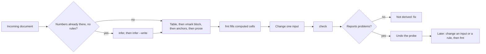
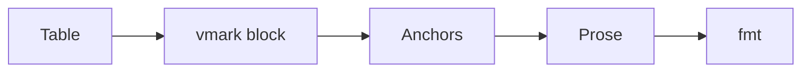

<!-- Generated from skills/visimark/SKILL.md by `bun run gen:mcp`.
     Do not edit this file by hand — edit the skill. -->

# VisiMark

## Overview

VisiMark makes a number in a Markdown document carry the formula that produced
it, so a machine can prove the two still agree. You are unreliable at
arithmetic and reliable at writing formulas. Write the formula; let the tool do
the arithmetic.

**Core principle: never write a number you calculated yourself.** If a number
follows from other numbers, it belongs in a `vmark` block as a rule, and the
tool writes the value.

## Handed an existing document? Run `infer` first

A table that already has its numbers — a quote or budget someone drafted the
ordinary way, no `vmark` block anywhere — **does not need its rules typed out
by hand.** Do not skip to "Authoring: the shape" below. Run:

```bash
visimark infer FILE...          # see what it proposes
visimark infer FILE... --write  # insert it
```

`infer` proposes only rules that reproduce every row exactly, verified against
the same evaluator `check` uses — never a best fit. Hand-author what it leaves:
`no rule found` is a genuine input, `also fits, not proposed` is a judgment
call it refuses to make for you.

`check` says the same thing, as a failure, on a document with no rules.



A header that already exists as human-facing prose — `Bandwidth per Unit
(TB/s, full-duplex)` — is not a formula name, and **you do not rewrite it into
one.** Rewriting someone else's header is exactly the kind of intrusion this
tool exists to avoid. `infer` proposes a short `is` alias for such a header
alongside its rule proposals; accept that, or write it yourself — see
"Non-identifier headers" below.

## The trap it closes: a green check proves nothing on its own

`visimark check` verifies that the formulas in a document agree with the
numbers. A document with **no formulas** has nothing to disagree with, so
`check` refuses to call it clean:

```
$ visimark check quote-with-no-formulas.md
quote-with-no-formulas.md

  COVERAGE a table with no `vmark` rules — nothing in this document is checked
           run `visimark infer` to derive them, or mark it `<!--vmark:no-formulas-->`

  1 problem (0 stale, 1 error)
$ echo $?
1
```

If you hand-compute the totals, write them as plain text, run `check`, and
report "the checker passes," you have reported a green build on a document with
no build. This finding is what stops that.

**Before reporting a VisiMark document as done, prove the numbers are derived.**
Change one input and confirm the checker starts complaining:

```bash
sed -i 's/| 40 |/| 48 |/' quote.md      # bump one input
visimark check quote.md                  # MUST now report problems, exit 1
git checkout quote.md                    # or undo the edit
```

If `check` still says `0 problems` after you changed an input, nothing in that
document is wired up. Fix it before you report anything.

The finding is keyed on a table being present, so a prose document — a README,
a changelog — is never asked for arithmetic it does not have. It is counted
document-wide, so a reference table that is legitimately all-input passes as
long as some other table in the document carries a rule.

For a document whose tables really are reference data with no arithmetic in
them, say so in the document itself:

```markdown
<!--vmark:no-formulas-->
```

`visimark infer FILE --write` writes that marker for you when it finds nothing
whatsoever to derive — and deliberately does **not** when it finds a near-miss
or an ambiguity, because those mean the document does have arithmetic and needs
a human. Never add the marker by hand to silence a failure you have not read:
that is the one move this finding exists to prevent. A marked document that
later grows rules is reported too, so the marker cannot outlive its truth.

## Running it

You reach VisiMark through this server's tools. Each one returns the same JSON
envelope the `visimark` CLI emits under `--json`, so what a field means is
what [`cli-reference.md`](visimark://cli-reference) says it means.

| Tool | What it does |
|---|---|
| `visimark_check` | Verify every computed number still agrees with its formula. Findings come back as a **successful** result with `status: "problems"` — a document that disagrees is not a broken call. |
| `visimark_fmt` | Plan the repair. Returns the edits and the artifact paths it would write, and writes nothing. |
| `visimark_fmt_apply` | Land a plan from `visimark_fmt`. Refused unless the operator started the server with `--allow-write` and the host declared a root. |
| `visimark_infer` | Propose rules for a document that has none. Returns proposals; writes nothing. |
| `visimark_infer_apply` | Land those proposals, behind the same gate. |
| `visimark_eval` | Evaluate the document; `get` selects a value, `scenarioContent` answers a what-if. |
| `visimark_explain` | The document's sheets, rules, precision and imports. |
| `visimark_ref` | What a builtin does. Reads no file. |

**Every read tool takes `path` or `content`.** A document you are drafting
in context has no path — pass it as `content` and skip the temp file. A
document given as `content` has no directory, so imports and generated
artifacts cannot be checked; the result's `skipped` names what was not looked
at, and it is not a clean pass.

**Do not guess a function's behaviour.** `visimark_ref` with a `name`
prints its signature, parameters, return type, errors and worked examples;
omit `name` for the whole reference. Every example it prints is executed
against the evaluator in CI, so what it says is what the engine does. The same
content is at [`function-reference.md`](visimark://function-reference).

**What-if questions: declare a `param`, never edit the document.** A value a
caller may want to vary — a rate, a cap, a headcount — is written
`param tax precision 3 = default 19%` (`precision` required, a literal
default). Every tool treats it as its default. `visimark_eval` with
`scenarioContent: "{\"tax\": \"12.5%\"}"` evaluates with that instead and
writes nothing: keys must name declared params, values must be JSON *strings*
that fit the precision, and a percent param takes a percent.

**Nothing is written unless you ask twice.** The plan tools never touch disk.
The apply tools take the plan you were given, refuse if the file changed
underneath it, and refuse entirely unless an operator opened the write gate.
If an apply tool answers `writes are disabled`, that is for the human running
the server to change, not something to work around.

Two worked documents are available as resources: a complete invoice at
[`example/invoice`](visimark://example/invoice), and the same invoice after
one input changed and nothing derived from it was updated, at
[`example/drift`](visimark://example/drift).

## Authoring: the shape

Four parts, in this order. The block must come **immediately after** its table.



````markdown
| Item           | Unit | Qty |    Rate |     Net |     VAT |
|----------------|------|----:|--------:|--------:|--------:|
| Consulting     | day  |   3 | 1600.00 | 4800.00 | 1104.00 |
| Implementation | hour |  40 |  210.00 | 8400.00 | 1932.00 |

```vmark #lines
Net = Qty * Rate
VAT = Net * vat
net_total   = SUM(Net)
gross_total = SUM(Net) + SUM(VAT)
avg_line precision 2 = net_total / COUNT(Net)
```

Net of tax this comes to **13200.00**<!--vmark=lines.net_total--> PLN,
or **16236.00**<!--vmark=lines.gross_total--> PLN gross.
````

- **Columns are uniform rules**, one per column, applied to every row. A column
  with no rule is a human-owned input and is never overwritten.
- **Totals are scalars**, declared in the same block. Never add a totals row —
  tables stay rectangular.
- **Anchors** put a scalar into a sentence. The HTML comment is invisible in
  GitHub, VS Code preview and pandoc. An anchor is an *output*: it never decides
  how wide a number is written.
- **Precision** is usually silent. A value's decimal width follows from its
  formula wherever the arithmetic bounds it — `+ - MIN MAX SUM` take the wider
  operand, `*` sums the two, `COUNT` is 0, `ROUND`/`FLOOR`/`CEILING` take theirs
  from an argument. **Division, `AVG`, `SQRT`, `PMT`, `NPV` and `IRR` bound nothing**, so a binding
  using one must say how wide it writes: `name precision N = expr`, `N` from 0
  to 18. Not declaring it is a `PRECISION` error, and `fmt` will not guess for
  you. Declare it electively too wherever a column holds money and must stay at
  two decimals if an input later gains a third.
- **`assert <boolean expr>`** in a `#id` block states an invariant `check` must
  hold — `assert variance == 0`, `assert ROUND(SUM(Share), 2) == 1`,
  `assert delivery >= signature`. It stores nothing and `fmt` never touches it;
  a false one is an `ASSERT` error. Scalar expressions only — a row-wise check is
  `assert MIN(margin) >= 0`. No rounding tolerance: round explicitly. Reach for
  one wherever a number's correctness depends on a relationship a later edit
  could break.

Write the table cells as `0.00` placeholders and run `visimark fmt` to fill
them in. Do not compute them yourself.

## Non-identifier headers

A column rule's name is ordinarily the header text itself, so it normally has
to be a bare identifier. A header with spaces, units or punctuation — the kind
a human actually writes — needs one of these instead of a rewrite:

```
"Bandwidth per Unit (TB/s, full-duplex)" is bpu
"GPU-to-GPU Bandwidth (GB/s, full-duplex)" =
    ROUND(bpu / GPUs * 1000, 0)
```

- **`"Header text" is symbol`** gives that column a short name usable
  everywhere afterward — as an operand, inside `SUM()`/other reduces, and as
  the left of an ordinary `symbol = expr` rule. This is the only way to *read*
  such a column in a formula; a bare quoted string is already a string
  literal, so it cannot double as an operand.
- **`"Header text" = expr`** writes a rule directly, no alias needed, when you
  only ever produce that column and never read it back elsewhere.

Matching is byte-for-byte against the header's exact printed text — no
trimming, no case-folding. Neither form ever touches the table: the header
stays exactly as written.

## Rules that bite

| Rule | Consequence if ignored |
|------|------------------------|
| An anchor names `sheet.scalar` — always qualified | A document-scope constant **cannot** be anchored. Put anything you want in prose inside a named sheet. |
| A block owns the table immediately above it, ignoring blank lines | A paragraph between table and block detaches the rules: `SHEET` error. |
| Cross-sheet column references must be qualified **and** aggregated | `SUM(schedule.Amount)` is legal; bare `schedule.Amount` is a `VECTOR` error. |
| Dates are ISO 8601 only, `YYYY-MM-DD` | `15.10.2026` is refused with an offered fix; `11/12/2026` is refused outright. |
| No thousands separators | `1,800.00` is a lex error. Write `1800.00`. |
| A currency or unit in a cell must be uniform down the column | `$5.50` and `€4.00` in one column is a `UNIT` error, not a sum. |
| Currency in prose goes **outside** the anchor | `**13200.00**<!--vmark=lines.net_total--> PLN` — not inside the bold. |
| A name bound twice in one scope is a `DUP` error | The first binding wins and the second is reported. |
| An unreferenced scalar is a `WARN` | Usually means you typo'd a column name and silently created a scalar. |
| Two header cells sharing identical text is a `DUP` error | Neither becomes usable as a name — bare or quoted — until the headers are told apart. |
| `is` is a reserved word | Naming a column or scalar `is` is refused; use it only for `"Header" is symbol` aliases. |
| `precision` is a reserved word too | Naming anything `precision` is refused, and `precision = 2` is not a document setting — there is no document- or sheet-wide precision. It goes on the binding: `total precision 2 = …`. |
| A division, `AVG`, `SQRT`, `PMT`, `NPV` or `IRR` with no `precision N` is a `PRECISION` error | No width follows from those operations. Take the width from what the document already shows, or decide it. |
| A number's width never comes from prose | Writing `0` as an anchor placeholder does **not** mean "zero decimals" any more. The anchor is rewritten at the binding's width, whatever you put there. |

## Editing an existing document

**Never hand-edit a computed cell or an anchored value.** Change the input or
the formula, then run `visimark fmt`. Hand-editing an output is the precise
failure the tool exists to catch, and `fmt` will overwrite you anyway.

`fmt` repairs stale values and nothing else. Every other finding is a question
only a person can answer — do not paper over a `DATE`, `UNIT`, `CYCLE`,
`UNDEF` or `DUP` finding by editing the number it points at.

## Rationalizations

| Excuse | Reality |
|--------|---------|
| "The arithmetic is trivial, I'll just write 4800" | You are unreliable at arithmetic and the value stops being reviewable. Write the rule. |
| "`check` passed, so the document is correct" | `check` passes on a document with no formulas. Prove derivation by changing an input. |
| "I'll add the formulas after the prose reads well" | You will forget, and the checker will not tell you. Table, block, anchors, then prose. |
| "A totals row is more readable" | It breaks the rectangle. Totals are scalars reached through anchors. |
| "I'll just fix that one cell by hand" | That cell is an output. Change the input or the rule and run `fmt`. |
| "The document already has numbers, I'll just write the same rules by hand" | Run `infer` first. It derives and verifies the rule from the numbers already there; hand-authoring re-does that work and can introduce the exact mistake the tool exists to catch. |
| "The date format is obvious from context" | `11/12/2026` is two different dates. VisiMark refuses on purpose. |
| "I'll widen the anchor to get more decimals" | The anchor is an output. Change the binding's `precision N`, or the formula. |

## Red flags — stop

- You typed a number that another number implies.
- You hand-authored `vmark` rules for a document that already had the arithmetic worked out, instead of running `infer` first.
- You reported "0 problems" without changing an input to see it break.
- You edited a value inside a `<!--vmark=…-->` anchor or a computed column.
- You added a `Total` row to a table.
- You wrote a date that is not exactly ten characters of `YYYY-MM-DD`.
- You wrote a division, `AVG`, `SQRT`, `PMT`, `NPV` or `IRR` and did not say how wide it writes.
- You changed a number's decimals by editing the text in front of an anchor.
- You silenced a finding by changing the number it complained about.

## Reference

`docs/visimark-design.md` in the repository is the normative spec, and
[`docs/function-reference.md`](visimark://function-reference) is the
generated per-function reference `visimark ref` serves.
`docs/example-invoice.md` is a complete worked example — a self-computing B2B
invoice with VAT, a payment schedule, early-payment terms, a currency
conversion and a reconciliation. `docs/example-invoice-drift.md` is the same
invoice after someone changed one input and updated nothing derived from it;
`check` finds 26 problems in it. Read the clean one before authoring.

<!--vmark:no-formulas-->
